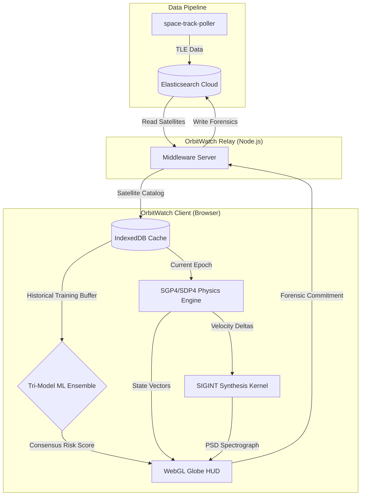

# OrbitWatch: Tactical Space Domain Awareness (SDA) Platform

OrbitWatch is a high-fidelity intelligence platform engineered for the autonomous detection, forensic analysis, and tactical attribution of anomalous Resident Space Objects (RSOs) in the Geostationary (GEO) belt. Built on a decentralized "Stealth-Local" paradigm, it processes sensitive orbital maneuvers at the edge, ensuring data sovereignty and zero-latency decision support.

## Key Features

*   **Tri-Model ML Ensemble**: Uses Deep Neural Autoencoders, Isolation Forests, and Geometric kNN to detect anomalies with absolute mathematical consensus.
*   **Real-Time SGP4/SDP4 Physics**: Propagates satellite state vectors at 60Hz directly in the browser for a high-fidelity tactical picture.
*   **SIGINT Synthesis**: Real-time Doppler-shifted spectral analysis to simulate Electronic Warfare (EW) indicators like noise injection and broadband jamming.
*   **Forensic Ledger**: A permanent, high-fidelity archival system for hostile attribution, committing every maneuver and signal capture to a searchable ledger.
*   **Elasticsearch Integration**: Reads satellite TLE data from your existing `space-track-satellites` index and writes forensic analysis to `sda-intelligence-ledger`.

## System Architecture



### Data Flow

1. **space-track-poller** ingests TLE data from Space-Track.org into Elasticsearch (`space-track-satellites` index)
2. **OrbitWatch Relay** reads satellite data from Elasticsearch and serves it to the frontend
3. **OrbitWatch Client** performs ML analysis in the browser
4. **Forensic results** are written back to Elasticsearch (`sda-intelligence-ledger` index)

## Technical Stack

*   **Frontend**: React 19, Tailwind CSS, Three.js (via react-globe.gl)
*   **AI/ML Core**: TensorFlow.js (Neural Networks), Custom TypeScript (Isolation Forest / kNN)
*   **Astro-Physics**: SGP4/SDP4 via satellite.js
*   **Middleware**: Node.js / Express
*   **Database**: Elasticsearch Cloud (read TLE, write forensics) / IndexedDB (local cache)

---

## DOCKER DEPLOYMENT

### Prerequisites

- Docker and Docker Compose installed
- Elasticsearch cluster with `space-track-satellites` index populated by space-track-poller
- Elasticsearch API key with read/write permissions

### Step 1: Create an API Key

1. Open **Kibana** for your Elasticsearch deployment
2. Go to **Management > Security > API Keys**
3. Click **"Create API key"**
4. Name it `orbitwatch`
5. Copy the **Base64-encoded** key

### Step 2: Configure Secrets

**Production (Docker Secrets):**
```bash
mkdir -p secrets

echo -n "https://your-deployment.es.us-west-1.aws.found.io:9243" > secrets/elastic_url
echo -n "your_base64_api_key" > secrets/elastic_api_key

chmod 600 secrets/*
```

**Development (.env file):**
```bash
cp .env.example .env
# Edit .env with your credentials
```

### Step 3: Deploy

**Production:**
```bash
docker-compose up -d --build
```

**Development:**
```bash
docker-compose -f docker-compose.dev.yml up --build
```

### Step 4: Access

Open browser to `http://localhost:8085`

---

## LOCAL DEVELOPMENT (Without Docker)

### Step 1: Install Dependencies
```bash
npm install
```

### Step 2: Configure Environment
```bash
cp .env.example .env
# Edit .env with your Elasticsearch credentials
```

### Step 3: Launch (Two Terminals)

**Terminal 1 - Relay Server:**
```bash
node server.js
```

**Terminal 2 - Frontend:**
```bash
npm run dev
```

Access at `http://localhost:3000`

---

## Configuration

| Variable | Description | Default |
|----------|-------------|---------|
| `ELASTIC_URL` | Elasticsearch endpoint URL | Required |
| `ELASTIC_API_KEY` | Base64-encoded API key | Required |
| `SATELLITE_INDEX` | Index to read TLE data from | `space-track-satellites` |
| `FORENSIC_INDEX` | Index to write forensics to | `sda-intelligence-ledger` |
| `RELAY_PORT` | Relay server port | `3001` |

---

## Security Notes

- **Never commit** `.env` files or `secrets/` contents to version control
- **Rotate API keys** if exposed in git history
- Uses **Elasticsearch API Key** authentication
- Credentials loaded from Docker Secrets (production) or environment variables (development)

---

## Viewing Data in Kibana

**Satellite Data (source):**
```
GET space-track-satellites/_search
```

**Forensic Analysis (OrbitWatch output):**
```
GET sda-intelligence-ledger/_search
```

---
*Operational ID: OW-STEALTH-PROTOCOL-V35*
