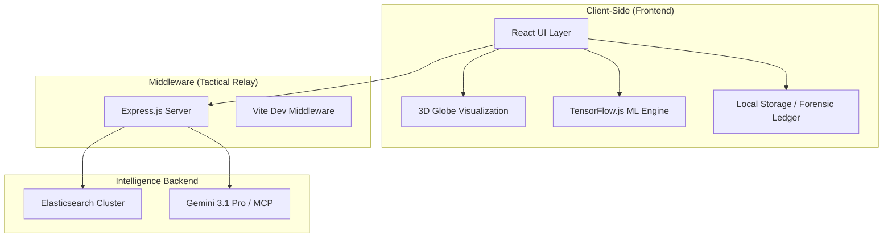
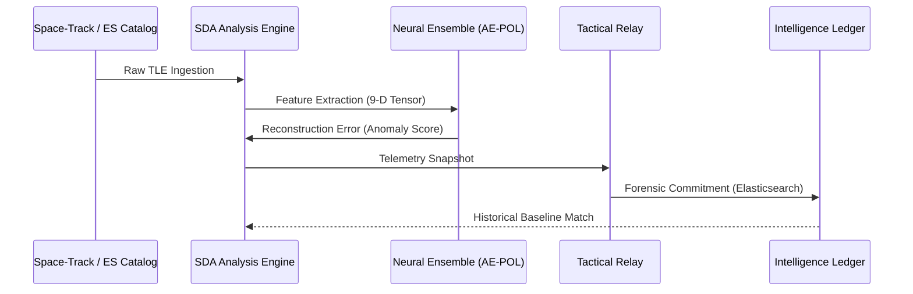
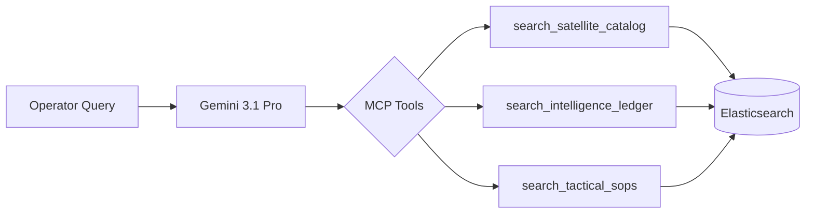

# ORBITWATCH: TACTICAL SPACE DOMAIN AWARENESS (SDA) PLATFORM
## Technical Documentation & System Specification

**By:** Ritvik Indupuri  
**Date:** 3/10/2026

---

## Table of Contents
1. [Executive Summary](#executive-summary)
2. [System Architecture](#system-architecture)
3. [Data Flow & Integration](#data-flow--integration)
4. [Core Features & Capabilities](#core-features--capabilities)
    - [Global Asset Monitoring](#global-asset-monitoring)
    - [Neural Ensemble Anomaly Detection](#neural-ensemble-anomaly-detection)
    - [Model Training & Retraining](#model-training--retraining)
    - [Tactical Forensic Investigation](#tactical-forensic-investigation)
        - [Dossier Ledger & Case Management](#dossier-ledger--case-management)
        - [Tactical Forensics View](#tactical-forensics-view)
        - [Strategic 3-Sigma Analysis](#strategic-3-sigma-analysis)
        - [Operational Logging & Reporting](#operational-logging--reporting)
    - [Tactical Framework Mapping (MITRE & SPARTA)](#tactical-framework-mapping-mitre--sparta)
    - [Orbital Dynamics & Trajectory Prediction](#orbital-dynamics--trajectory-prediction)
    - [Signal Intelligence (SIGINT) Analysis](#signal-intelligence-sigint-analysis)
5. [Intelligence Link & Middleware](#intelligence-link--middleware)
6. [MCP Intelligence Assistant (ChatBot)](#mcp-intelligence-assistant-chatbot)
7. [Conclusion](#conclusion)

---

## Executive Summary
OrbitWatch is a next-generation Space Domain Awareness (SDA) platform designed for high-fidelity monitoring, forensic attribution, and tactical analysis of orbital assets. In an increasingly congested and contested space environment, OrbitWatch provides mission operators with real-time detection of non-nominal satellite behavior, ranging from subtle drift maneuvers to aggressive Rendezvous and Proximity Operations (RPO). By leveraging a Tri-Model Neural Ensemble and a secure Intelligence Relay to Elasticsearch, the platform bridges the gap between raw telemetry and actionable strategic intelligence.

The system is built on a modern full-stack architecture, utilizing React for a high-performance 3D visualization layer, TensorFlow.js for client-side machine learning, and an Express-based middleware for secure data persistence and external intelligence integration.

---

## System Architecture

The OrbitWatch architecture is designed for "Stealth-Local" operation with optional "Centralized Intelligence" synchronization. This split-plane approach ensures that tactical analysis can continue even in disconnected environments while allowing for global data sharing when a secure link is established.

**Figure 1: OrbitWatch System Architecture Diagram.**  
*This diagram illustrates the multi-tier architecture of OrbitWatch. The Frontend handles all real-time visualization and local ML inference, while the Middleware acts as a secure gateway to the centralized Elasticsearch intelligence store and the Gemini-powered MCP assistant.*

---

## Data Flow & Integration

Data flows through OrbitWatch in a continuous loop of ingestion, analysis, and attribution. Raw TLE (Two-Line Element) data is ingested from the centralized catalog, processed into orbital state vectors, and fed into the neural ensemble for anomaly scoring.

**Figure 2: OrbitWatch Data Flow Diagram.**  
*The data flow sequence highlights the transition from raw orbital data to high-fidelity forensic commitment. The Neural Ensemble performs real-time reconstruction analysis to identify deviations from established Patterns of Life (PoL).*

---

## Core Features & Capabilities

### Global Asset Monitoring
The primary interface of OrbitWatch is a high-performance 3D Globe visualization powered by `react-globe.gl`. It renders the entire satellite catalog in real-time, using SGP4 propagation to calculate precise geodetic coordinates. Assets are color-coded by threat level, with "Critical" alerts pulsing in red to command immediate operator attention.

### Neural Ensemble Anomaly Detection
OrbitWatch utilizes a high-fidelity Tri-Model Neural Ensemble to ensure high-confidence threat attribution. The ensemble operates on a **9-Dimensional (9D) Feature Vector** extracted from real-time TLE state vectors, providing a comprehensive geometric and kinetic profile of every asset.

#### The 9D Feature Vector
Every model in the ensemble processes a synchronized 9D tensor representing the asset's orbital state:
1.  **Inclination**: Orbital tilt relative to the equator.
2.  **Eccentricity**: Deviation from a perfect circular orbit.
3.  **Mean Motion**: Number of orbits completed per 24-hour period.
4.  **RAAN**: Right Ascension of the Ascending Node (orbital "twist").
5.  **Argument of Perigee**: Orientation of the elliptical orbit.
6.  **Mean Anomaly**: Instantaneous position within the orbital path.
7.  **Semi-Major Axis (SMA)**: The average height/size of the orbit.
8.  **Apogee**: Maximum altitude (km).
9.  **Perigee**: Minimum altitude (km).

#### 1. AE-POL (Autoencoder Pattern of Life)
- **What it is:** A deep neural autoencoder designed for non-linear manifold learning.
- **What it does:** It learns a compressed, "bottlenecked" representation of nominal orbital behavior. It acts as a digital twin of the "Global Pattern of Life."
- **How it is trained:** 
    - **Architecture:** Symmetric 9-16-8-16-9 dense layers with ReLU activation.
    - **Optimization:** Trained using the **Adam optimizer** with **Mean Squared Error (MSE)** as the loss function.
    - **Hyperparameters:** 20 epochs, batch size 32, with Z-score normalization applied to all inputs.
- **Training Data Size:** Utilizes a global baseline of the latest **1,440 minutes (24 hours)** of telemetry for the entire satellite catalog.
- **Risk Score Calculation:** Derived from the **Reconstruction Error**. The model attempts to reconstruct the 9D input vector; the MSE between the input and the reconstructed output represents the "Anomaly Score." A high score indicates the asset has entered a physics state that contradicts its learned Pattern of Life.

#### 2. IF-SCAN (Isolation Forest)
- **What it is:** An unsupervised ensemble model based on decision trees.
- **What it does:** It performs statistical outlier detection by measuring how "easy" it is to isolate a specific asset's 9D vector from the rest of the population.
- **How it is trained:** 
    - **Process:** The model recursively partitions the 9D feature space using random axis-aligned splits to build an ensemble of **100 isolation trees**.
    - **Logic:** Anomalies are isolated much faster (closer to the root of the tree) than nominal data points.
- **Training Data Size:** Synchronized with the global **1,440-minute (24-hour)** telemetry window.
- **Risk Score Calculation:** The score is calculated based on the **Average Path Length** required to isolate the asset across the forest. Shorter path lengths result in a higher anomaly score, indicating the asset is a statistical outlier in the current orbital environment.

#### 3. KNN-SYNC (K-Nearest Neighbors)
- **What it is:** A geometric spatial index model utilizing a KD-Tree.
- **What it does:** It monitors for "Geometric Synchronicity" and "Clustering Deviations," which are primary indicators of Rendezvous and Proximity Operations (RPO).
- **How it is trained:** 
    - **Process:** The model constructs a high-dimensional spatial index of all 9D feature vectors in the current catalog.
    - **Parameters:** Configured with $k=5$ to monitor the local neighborhood of every asset.
- **Training Data Size:** Rebuilt every **1,440 minutes (24 hours)** to maintain a real-time geometric map of the orbital population.
- **Risk Score Calculation:** Calculated as the **Euclidean Distance** to the $k$ nearest neighbors in the 9D feature space. If an asset's distance to its neighbors suddenly decreases (shadowing) or the group's centroid shifts (synchronized maneuver), the score spikes, flagging a potential RPO engagement.

### Model Training & Retraining Process
OrbitWatch features a robust retraining pipeline to maintain detection accuracy in a dynamic space environment. This process allows the system to adapt to seasonal orbital drift, scheduled fleet maneuvers, and evolving space-track distributions.

#### 1. The Retraining Loop
The retraining process follows a rigorous 5-step pipeline implemented in `tensorFlowService.ts`:
1.  **Data Collection:** The system ingests the latest **1,440 minutes (24 hours)** of telemetry for all active assets in the catalog. This ensures the model is always learning from the most recent "normal" behavior.
2.  **Feature Extraction:** Telemetry is converted into the high-fidelity **9D feature vector**.
3.  **Normalization (Z-Score):** Tensors are normalized using Z-score standardization. The system calculates the **Mean ($\mu$)** and **Standard Deviation ($\sigma$)** for each of the 9 dimensions. This ensures that features with different scales (e.g., Inclination in degrees vs. SMA in kilometers) contribute equally to the model's loss function. To prevent division by zero, a small epsilon ($10^{-7}$) is added to the standard deviation.
4.  **Neural Weight Update:** The Autoencoder's weights are updated using the **Adam optimizer** and **Mean Squared Error (MSE)** loss. The model is trained over **20 epochs** with a **batch size of 32**. During this phase, the network learns to compress and then perfectly reconstruct the 9D vectors of nominal satellites.
5.  **Memory Management & Promotion:** After training, the system explicitly disposes of intermediate tensors (`tensorData.dispose()`, `normalizedData.dispose()`) to prevent memory leaks in the browser environment. The new model weights and normalization parameters are then promoted to the active monitoring role.

#### 2. Inference Scaling & Anomaly Scoring
Once the model is trained, the reconstruction error for a given asset is converted into a normalized anomaly score:
- **MSE Calculation:** The system calculates the MSE between the normalized input vector and the model's reconstruction.
- **Sigmoid Scaling:** To provide a human-readable score, the raw MSE is scaled using a sigmoid-like function: $AE_{score} = \min(1, MSE \times 5)$. This ensures that typical "nominal" errors (usually $<0.1$) result in low scores, while significant deviations quickly saturate the risk level.

#### 3. Retraining Triggers
- **Manual Reset:** Operators can trigger a "Neural Baseline Reset" from the Model Training Widget when a significant mission shift occurs or when a large batch of new assets is added to the catalog.
- **Drift Detection:** The system automatically monitors the global TLE distribution. If the average reconstruction error across the entire catalog increases significantly (indicating a global shift in orbital dynamics or atmospheric conditions), a retraining event is queued.
- **Scheduled Maintenance:** Periodic retraining ensures the platform remains resilient against long-term orbital perturbations (e.g., solar radiation pressure, atmospheric drag).

#### 4. Execution Environment & Performance
- **Main Thread Execution:** Model training and inference are executed on the main application thread via TensorFlow.js.
- **Hardware Acceleration:** The system utilizes the **WebGL/WebGPU backend** for high-performance tensor operations, offloading computational load from the CPU to the GPU.
- **Initialization Blocking:** To ensure data integrity, the SDA Intelligence Link remains in a "Training" state during the initial baseline establishment, preventing anomaly analysis until the manifold is fully converged. This ensures that no "false negatives" occur due to an uninitialized model.

### Tactical Forensic Investigation
When an anomaly is detected, operators can open a "Forensic Investigation." This module captures a permanent snapshot of the asset's state, including its TLE, risk score, and MITRE ATT&CK/SPARTA framework mappings. These investigations are stored in a local forensic ledger and can be committed to the global Elasticsearch cluster for cross-mission analysis.

#### Dossier Ledger & Case Management
The **Dossier Ledger** serves as the primary repository for all active and historical investigations.
- **Case Identification:** Each investigation is assigned a unique **Correlation ID (CID)** for tracking across mission instances.
- **Lifecycle Status:** Cases transition through four distinct phases:
    1. **Preliminary Review:** Initial detection and automated triage.
    2. **Active Forensics:** Deep-dive analysis and spectral correlation.
    3. **Hostile Attribution:** Framework mapping and intent determination.
    4. **Closed/Reported:** Final mission report generation and archival.

#### Tactical Forensics View
This view provides a high-fidelity snapshot of the asset's state at the moment of the non-nominal event.
- **Physics State Snapshot:** Captures the propagated telemetry, including **Apogee Altitude**, **Scalar Velocity**, **Inclination**, and **WGS84 Altitude**.
- **Framework Intelligence:** Displays the real-time mapping to **MITRE ATT&CK for Space** and **SPARTA** taxonomies.
- **Verification Matrix:** Shows the individual confidence scores from the **AE-POL**, **IF-SCAN**, and **KNN-SYNC** models, culminating in the **Consensus Risk Score**.
- **Consensus Risk Score Calculation:** The final risk score is a weighted ensemble probability derived from the three primary models:
    - **AE-POL Weight (40%):** The primary indicator of behavioral deviation from the learned Pattern of Life.
    - **IF-SCAN Weight (30%):** Provides statistical context on how rare the maneuver is across the global population.
    - **KNN-SYNC Weight (30%):** Focuses on geometric synchronization and proximity risk.
    - **Formula:** $RiskScore = \lfloor (AE_{score} \times 0.4 + IF_{score} \times 0.3 + KNN_{score} \times 0.3) \times 100 \rfloor$
- **Spectral SIGINT Forensics:** A dedicated spectral density chart that visualizes RF power across the S-Band, highlighting localized noise floor elevations and active jamming spikes.

#### Strategic 3-Sigma Analysis
For high-confidence attribution, operators can perform a longitudinal audit against the asset's historical behavior.
- **Data Ingestion:** Supports the ingestion of historical TLE sets (CSV/3LE format) to establish a behavioral manifold.
- **Gaussian-σ3 Audit:** The system calculates the **Mean ($\mu$)** and **Standard Deviation ($\sigma$)** for key features (Inclination, Mean Motion, Eccentricity).
- **Threshold Violation:** If the asset's current state deviates by **$>3\sigma$** from its historical mean, it is flagged as a **Critical Departure**, confirming a non-nominal kinetic event with high statistical confidence.
- **Distribution Visualization:** Provides interactive bell-curve charts showing the asset's current position relative to its historical distribution.

#### Operational Logging & Reporting
- **Intelligence History:** A permanent, immutable ledger where operators can commit observations, log entries, and attribution notes. Each entry is timestamped and attributed to the operator.
- **Mission Report Generation:** Operators can generate a comprehensive **Markdown Mission Report** (`.md`). This report encapsulates the tactical state vector, ensemble consensus, 3-Sigma findings, and framework mappings, providing a standardized document for strategic briefing.

### Tactical Framework Mapping (MITRE & SPARTA)
OrbitWatch standardizes threat attribution by mapping detected anomalies to established aerospace security frameworks. This ensures that forensic reports are interoperable with broader defense intelligence systems.

#### 1. MITRE ATT&CK for Space
The platform utilizes the MITRE ATT&CK framework to categorize the *techniques* used by non-nominal assets. This provides a common language for describing adversary behavior in the space domain.
- **T1584.001 (RPO Synchronization):** Mapped when the KNN-SYNC model detects co-orbital proximity engagement.
- **T1584.006 (Nodal Migration):** Mapped when high-energy plane changes are detected via inclination shifts.
- **T1584.005 (Kinetic Delta-V Burn):** Mapped when sudden velocity changes exceed standard station-keeping thresholds.
- **T1584.004 (Phasing/Drift):** Mapped during controlled longitudinal repositioning events.
- **T1602 (Signal Interference):** Mapped when SIGINT analysis detects antenna orientation toward sensitive assets combined with noise floor elevation.

#### 2. SPARTA (Space Attack Pre-conditions and Trajectories Association)
While MITRE focuses on techniques, SPARTA provides a more specialized taxonomy for space-centric attack vectors and mission impacts.
- **REC-0002 (Co-orbital Proximity):** Used for Rendezvous and Proximity Operations.
- **IMP-0003 (Orbital Displacement):** Used for significant displacement from an assigned orbital slot.
- **EX-0001 (Maneuver Execution):** Used for any aggressive or unexplained kinetic maneuver.
- **IMP-0001 (Physical Denial):** Mapped when an asset violates the "Respect Zone" or safety ellipsoid of another satellite.
- **IMP-0005 (Electronic Interference):** Mapped during detected jamming or signal injection postures.

#### 3. The Heuristic Mapping Engine
The `tensorFlowService.ts` includes a tactical taxonomy engine that translates raw neural scores into these framework IDs. The mapping logic follows a hierarchical priority:
1. **Geometric Priority:** If `knnScore` > 0.8, the event is prioritized as **RPO (REC-0002)** regardless of other scores.
2. **Energy Priority:** If `aeScore` > 0.7 and a velocity shift is detected, it is mapped to **Plane Change (IMP-0003)**.
3. **Proximity Priority:** If the overall `riskScore` > 85 without a specific geometric match, it is flagged as a **Keep-Out Zone Violation (IMP-0001)**.
4. **Baseline Priority:** All other kinetic anomalies default to **Kinetic Burn (EX-0001)** for general maneuver attribution.

### Orbital Dynamics & Trajectory Prediction
The "Orbital Dynamics" workstation provides sub-minute precision for high-fidelity mission analysis.
- **Propagation Engine:** Utilizes the `satellite.js` library for SGP4/SDP4 propagation, ensuring accurate state-vector reconstruction across LEO, MEO, and GEO regimes.
- **High-Resolution Trajectory:** Generates trajectory data at **10-second intervals**, allowing for the detection of micro-maneuvers that are often missed by standard 60-second polling.
- **Cartesian State Vectors (ECI):** Calculates Earth-Centered Inertial position ($X, Y, Z$ in km) and velocity ($vX, vY, vZ$ in km/s) with 4-decimal precision.
- **Keplerian Element Extraction:** Real-time extraction of the "Classical Orbital Elements":
    - **Semi-Major Axis (SMA):** Derived from Mean Motion and the Earth's gravitational parameter ($\mu$).
    - **Eccentricity & Inclination:** Monitored for plane-change and orbit-shaping maneuvers.
    - **RAAN & Argument of Perigee:** Used to identify nodal precession and perigee rotation tactics.
- **Geodetic Metrics:** Calculates instantaneous **Altitude** (relative to the WGS84 ellipsoid) and **Scalar Velocity**, providing a clear picture of the asset's kinetic energy state.

### Signal Intelligence (SIGINT) Analysis
The platform includes a high-resolution spectral density simulator for the **S-Band (2.245 GHz)**, providing operators with a tactical view of the asset's electronic posture.
- **Doppler-Shift Compensation:** The center frequency is dynamically adjusted based on the asset's scalar velocity relative to the speed of light ($c$), simulating real-world orbital RF characteristics.
- **Noise Floor Monitoring:**
    - **Nominal Baseline:** Established at **-115 dBm**.
    - **Interference Detection:** Automatically flags a "Signal Interference Posture" when the noise floor rises by **>30dB** (typically reaching -82 dBm).
- **Spectral Component Analysis:**
    - **Main Carrier Peak:** Gaussian-modeled signal strength analysis.
    - **Sideband/Harmonic Detection:** Monitors for $\pm 0.002$ GHz sidebands to identify modulation health.
    - **Jamming Spike Attribution:** Identifies random power spikes (up to 40dB above noise) as indicators of active Electronic Warfare (EW) or intentional jamming.
- **Tactical Response:** Spectral anomalies are mapped to **SPARTA IMP-0005 (Electronic Impact)** and trigger Electronic Warfare response protocols, including frequency hopping recommendations.

---

## Intelligence Link & Middleware
The `server.ts` middleware provides a secure, high-performance bridge to a centralized **Elasticsearch** intelligence cluster. This architecture is designed for massive scalability and rapid forensic retrieval.

### Elasticsearch Architecture & Benefits
- **Centralized Intelligence:** By offloading data persistence to Elasticsearch, OrbitWatch allows for a unified "Single Source of Truth" across multiple mission instances.
- **High-Speed Forensic Search:** Elasticsearch's distributed indexing allows for sub-second retrieval of historical anomalies and TLE state vectors, even across millions of records.
- **Automated Space-Track Ingestion:** The backend Elasticsearch cluster is pre-configured to automatically ingest and synchronize data from **Space-Track.org**. OrbitWatch consumes this processed data, ensuring that the satellite catalog is always current without requiring direct client-side authentication to external registries.

### User Configuration & Connectivity
Operators establish the intelligence link by configuring their credentials directly within the **OrbitWatch Settings** interface:
1. **Elasticsearch URL:** The endpoint for the tactical cluster.
2. **Authentication:** Secure entry of Username and Password/API Key.
3. **Mission ID:** A unique identifier used to scope forensic commitments to a specific operation.

Once configured, the `relayService.ts` performs a real-time health handshake to verify the link status, transitioning the platform from "Stealth-Local" to "Centralized Intelligence" mode.

### Data Dispatch & Relay
The middleware handles three primary data streams:
- **Mission Relay:** Dispatches telemetry and forensics to the `sda-intelligence-ledger` index.
- **Catalog Sync:** Proxies requests to the `satellite-catalog` index, allowing for a unified view of global space assets.
- **Health Handshake:** Continuously monitors the link to the centralized intelligence cluster, providing real-time status updates to the operator.

---

## MCP Intelligence Assistant (ChatBot)
The **OrbitWatch Assistant** is a highly detailed AI agent powered by Gemini 3.1 Pro, integrated via the **Model Context Protocol (MCP)**. It serves as the primary natural language interface for mission operators.

### Detailed Capabilities & Tool Integration
The assistant is not just a text generator; it is a functional bridge to the platform's core data services. It utilizes three specialized MCP tools:

1.  **`search_satellite_catalog`**:
    - **Functionality:** Performs high-speed multi-match queries against the `satellite-catalog` index in Elasticsearch.
    - **Search Parameters:** Can search by `OBJECT_NAME`, `NORAD_CAT_ID`, `OWNER`, or `ORGANIZATION`.
    - **Use Case:** "Find all Starlink satellites launched in the last 2 years" or "Show me the TLE for NORAD ID 25544."

2.  **`search_intelligence_ledger`**:
    - **Functionality:** Accesses the forensic mission history stored in the `sda-intelligence-ledger`.
    - **Filtering:** Supports filtering by `missionId`, `type` (ANOMALY, MANEUVER), or keyword search in forensic descriptions.
    - **Use Case:** "What were the last 5 critical anomalies detected in the GEO belt?" or "Summarize the forensic report for the SJ-21 tug event."

3.  **`search_tactical_sops`**:
    - **Functionality:** Queries the Standard Operating Procedures database for mission-specific guidance.
    - **Categories:** RPO, EW, KINETIC, and GENERAL.
    - **Use Case:** "What is the required safety ellipsoid for a non-cooperative RPO?" or "What is the response protocol for a 15dB noise floor rise?"

### Intelligence Reasoning Loop
When an operator asks a question, the assistant follows a multi-step reasoning process:
1. **Intent Extraction:** Identifies which MCP tools are required to answer the query.
2. **Tool Execution:** Calls the local Tactical Relay to fetch data from Elasticsearch.
3. **Context Synthesis:** Combines the retrieved data with its internal knowledge of orbital mechanics and tactical frameworks (MITRE/SPARTA).
4. **Technical Summarization:** Provides a concise, technical response, highlighting NORAD IDs, risk levels, and specific SOP sections.

**Figure 3: MCP Intelligence Assistant Integration.**  
*The assistant acts as a natural language interface to the complex data structures of OrbitWatch. By calling MCP tools, it can retrieve NORAD IDs, mission history, and tactical SOPs to provide the operator with concise, actionable summaries.*

---

## Conclusion
OrbitWatch represents a significant leap forward in tactical Space Domain Awareness. By combining real-time 3D visualization, neural-ensemble anomaly detection, and a secure intelligence relay, it provides mission operators with the tools necessary to maintain space superiority. The platform's ability to perform high-fidelity forensic attribution and provide automated tactical guidance via its MCP assistant ensures that decision-makers have the most accurate and timely information available in the space domain.

---
**End of Documentation**
