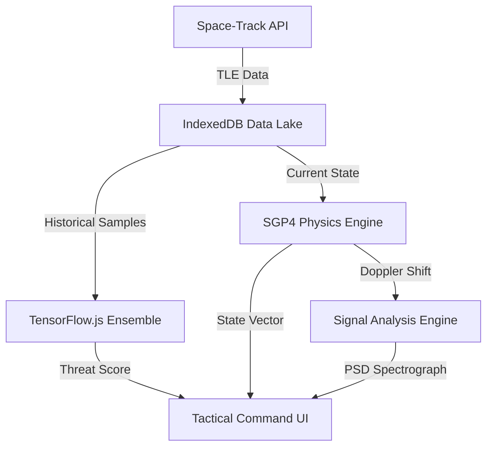

# OrbitWatch Tactical SDA Platform

OrbitWatch is a decentralized Space Domain Awareness (SDA) platform designed for the real-time identification and analysis of Resident Space Objects (RSOs) exhibiting anomalous orbital or spectral behavior. The application serves as a technology demonstrator for automated threat assessment in the Geostationary (GEO) belt, utilizing browser-based Machine Learning and high-fidelity physics propagation.

## System Overview

The platform operates as a client-side mission control center. It ingests Two-Line Element (TLE) data from public registries, executes SGP4 orbital propagation, and runs a localized Machine Learning ensemble to detect deviations from nominal station-keeping manifolds. It is specifically optimized for the GEO regime, allowing for high-precision maneuver detection that generalized systems often miss.

### Core Capabilities

*   **Real-time Tracking**: Interactive 3D visualization of the GEO belt synchronized with live mission clocks.
*   **Ensemble Intelligence**: A consensus-based threat score derived from Deep Autoencoders, Isolation Forests, and Geometric kNN detectors.
*   **SIGINT Synthesis**: Simulation of Power Spectral Density (PSD) based on Doppler-shifted telemetry and path loss calculations.
*   **Cyber-Orbital Mapping**: Automated attribution of anomalies to tactical frameworks including MITRE ATT&CK for Space and SPARTA.

## System Architecture



### Data Processing Pipeline

1.  **Ingestion**: Retrieval of orbital records filtered strictly for GEO (Mean Motion 0.95-1.05).
2.  **Storage**: Persistence of telemetry snapshots in a local IndexedDB to enable longitudinal behavior analysis.
3.  **Inference**: Batch processing of active assets through a 7-dimensional feature vector training loop.
4.  **Visualization**: Rendering of state vectors on a hardware-accelerated WebGL globe.

## Technology Stack

*   **Frontend Framework**: React 19 (TypeScript)
*   **Rendering Engine**: Three.js via react-globe.gl
*   **Physics Core**: satellite.js (SGP4/SDP4 propagation)
*   **Machine Learning**: TensorFlow.js (WebGL backend)
*   **Data Management**: IndexedDB (NoSQL browser storage)
*   **Visual Analytics**: Recharts (SVG spectral and trajectory graphs)
*   **Styling**: Tailwind CSS 3.4

## Setup and Deployment

### Prerequisites

*   Node.js (v18 or higher)
*   NPM or Yarn
*   Modern browser with WebGL 2.0 and IndexedDB support

### Installation

1. Clone the repository to your local workstation:
   ```bash
   git clone https://github.com/organization/orbitwatch-sda.git
   cd orbitwatch-sda
   ```

2. Install the necessary dependencies:
   ```bash
   npm install
   ```

3. Start the development environment:
   ```bash
   npm run dev
   ```

4. Access the application at `http://localhost:3000`.

### Mission Initialization

Upon launch, the system requires valid Space-Track.org credentials to fetch live TLE data. If network restrictions or CORS policies block the live API, the system will automatically utilize a cached high-fidelity GEO snapshot to ensure operational continuity for demonstration purposes.

---
Developed for Orbital Warfare Directorate Demonstration.
