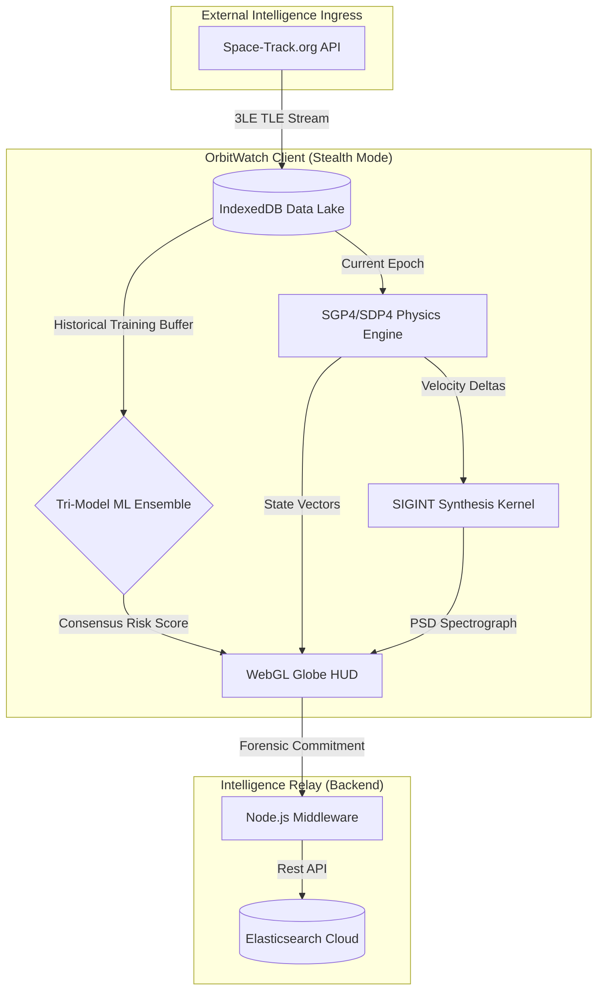

# OrbitWatch: Tactical Space Domain Awareness (SDA) Platform

OrbitWatch is a high-fidelity intelligence platform engineered for the autonomous detection, forensic analysis, and tactical attribution of anomalous Resident Space Objects (RSOs) in the Geostationary (GEO) belt. Built on a decentralized "Stealth-Local" paradigm, it processes sensitive orbital maneuvers at the edge, ensuring data sovereignty and zero-latency decision support.

##  Key Features

*   **Tri-Model ML Ensemble**: Uses Deep Neural Autoencoders, Isolation Forests, and Geometric kNN to detect anomalies with absolute mathematical consensus.
*   **Real-Time SGP4/SDP4 Physics**: Propagates satellite state vectors at 60Hz directly in the browser for a high-fidelity tactical picture.
*   **SIGINT Synthesis**: Real-time Doppler-shifted spectral analysis to simulate Electronic Warfare (EW) indicators like noise injection and broadband jamming.
*   **Forensic Ledger**: A permanent, high-fidelity archival system for hostile attribution, committing every maneuver and signal capture to a searchable ledger.
*   **Intelligence Relay**: A bridge to Elasticsearch Cloud for multi-operator sync, historical pattern matching, and fleet-wide behavioral metrics.

##  System Architecture



### Architectural Deep-Dive
OrbitWatch implements a **Local-First, Cloud-Archived** topology to ensure operational security:

1.  **Local Core**: All critical physics propagation, machine learning inference, and 3D rendering are executed in the client browser using WebGL and TensorFlow.js. This ensures that sensitive intelligence is processed in "Stealth Mode" and never leaves the local environment unless explicitly committed.
2.  **Data Lake**: The system uses **IndexedDB** as a high-speed local data lake. It stores the last 5 ingested snapshots (approx. 1,500 orbital records) to build a longitudinal baseline of "Normal" behavior for every satellite individually.
3.  **Relay Middleware**: The `server.js` Node.js component serves as the tactical bridge. It monitors mission events (telemetry ingestion, forensic captures) and relays them to a centralized **Elasticsearch** cluster for long-term archival.

##  Technical Stack
*   **Frontend**: React 19, Tailwind CSS, Three.js (via react-globe.gl)
*   **AI/ML Core**: TensorFlow.js (Neural Networks), Custom TypeScript (Isolation Forest / kNN)
*   **Astro-Physics**: SGP4/SDP4 via satellite.js
*   **Middleware**: Node.js / Express
*   **Backend Database**: Elasticsearch Cloud (Archival) / IndexedDB (Hot Storage)

---

## 🛠 SETUP GUIDE: BABY STEPS

Follow these instructions exactly to initialize your SDA environment using only your terminal.

### Step 1: Clone and Install
1.  **Open your Terminal** (Terminal on Mac/Linux, PowerShell on Windows).
2.  **Clone the code** into your machine:
    ```bash
    git clone <your-repository-url>
    ```
3.  **Enter the directory**:
    ```bash
    cd orbitwatch
    ```
4.  **Install dependencies**:
    ```bash
    npm install
    ```

### Step 2: Create your Elastic Cloud Infrastructure
1.  Navigate to [cloud.elastic.co](https://cloud.elastic.co/registration) and sign up.
2.  Click the blue **"Create Deployment"** button.
3.  Choose a name like `OrbitWatch-Intel`.
4.  **CRITICAL**: You will see a **Password** on the screen. **COPY THIS IMMEDIATELY** and save it in a notepad. You cannot see it again.
5.  Wait for the status to turn to "Healthy," then copy the **Elasticsearch Endpoint URL** (it starts with `https://` and ends in `.io:443`).

### Step 3: Configure the Mission Relay
You must tell the software where your cloud is located.
1.  **Open the configuration file** using one of these commands in your terminal:
    *   **If you have VS Code**: `code server.js`
    *   **If you want to edit inside the terminal (Recommended)**: `nano server.js`
2.  Find lines **20 and 23**. You will see:
    ```javascript
    const ELASTIC_URL = "PASTE_YOUR_URL_HERE";
    const ELASTIC_PASSWORD = "PASTE_YOUR_PASSWORD_HERE";
    ```
3.  **Paste your details** exactly inside the double quotes.
4.  **Save and Exit**:
    *   **VS Code**: Press `Ctrl + S` and close the window.
    *   **Nano (Terminal)**: Press `Ctrl + O`, then press `Enter` to save, then press `Ctrl + X` to exit.

### Step 4: Launch the System (The Two-Terminal Rule)
You must have two processes running at the same time to link the relay.

1.  **Terminal 1 (The Relay Server)**:
    Type this and press Enter:
    ```bash
    node server.js
    ```
    *   **Wait until you see**: `ORBITWATCH TACTICAL RELAY ACTIVE`.
    *   **Crucial**: Leave this window open. Do not close it.

2.  **Terminal 2 (The Frontend App)**:
    Open a **NEW** terminal tab or window (Right-click your terminal icon -> New Window), then type:
    ```bash
    cd orbitwatch
    npm run dev
    ```
    *   **Wait until you see**: `Local: http://localhost:3000`.

### Step 5: Viewing Your Intelligence Data
Once the system is running, here is how you see the data inside Elasticsearch:

1.  Open your browser to `http://localhost:3000` and log in with your Space-Track.org credentials.
2.  Go to your **Elastic Cloud Dashboard** in your browser.
3.  Find your deployment and click the **"Open Kibana"** button.
4.  Inside Kibana, open the **Main Menu** (the three horizontal lines in the top left corner).
5.  Scroll down to **"Management"** and click on **"Dev Tools"**.
6.  In the editor window on the left, delete everything and type:
    ```http
    GET sda-intelligence-ledger/_search
    ```
7.  Click the **small "Play" button** next to the line you just typed.
8.  **The Result**: On the right side of the screen, you will see your satellite detections and forensic packages appearing as live JSON data!

---
*Operational ID: OW-STEALTH-PROTCOL-V35*

Developed for Orbital Warfare Directorate Demonstration.
