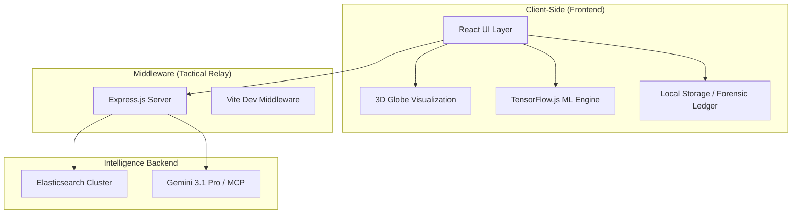

# OrbitWatch: Tactical Space Domain Awareness (SDA) Platform

OrbitWatch is a high-fidelity Space Domain Awareness (SDA) platform designed for real-time monitoring, forensic attribution, and tactical analysis of global orbital assets. It provides mission operators with advanced detection capabilities for non-nominal satellite behavior, utilizing a neural ensemble to identify threats such as Rendezvous and Proximity Operations (RPO) and Electronic Warfare (EW) postures.

## Key Features

- **Global Asset Monitoring:** Real-time 3D Globe visualization of the entire satellite catalog using high-precision SGP4 propagation.
- **Neural Ensemble Anomaly Detection:** A Tri-Model system (AE-POL, IF-SCAN, KNN-SYNC) that identifies orbital deviations using a high-fidelity 9D feature vector (including Apogee and Perigee).
- **Model Training & Retraining:** Dynamic neural baseline resets that allow the system to adapt to natural orbital drift and scheduled maneuvers.
- **Tactical Forensic Investigation:** A permanent forensic ledger for capturing state-vector snapshots and strategic analysis.
- **Orbital Dynamics Workstation:** 10-second interval trajectory prediction providing Cartesian ECI position and velocity vectors.
- **Signal Intelligence (SIGINT):** Simulated RF spectrum analysis for detecting jamming stances and signal interference.
- **MCP Intelligence Assistant:** A Gemini-powered chatbot integrated via Model Context Protocol (MCP) for natural language data retrieval.

---

## System Architecture

```mermaid
graph TD
    subgraph "Client-Side (Frontend)"
        UI[React UI Layer]
        Globe[3D Globe Visualization]
        TF[TensorFlow.js ML Engine]
        LS[Local Storage / Forensic Ledger]
    end

    subgraph "Middleware (Tactical Relay)"
        Express[Express.js Server]
        Vite[Vite Dev Middleware]
    end

    subgraph "Intelligence Backend"
        ES[Elasticsearch Cluster]
        Gemini[Gemini 3.1 Pro / MCP]
    end

    UI --> Globe
    UI --> TF
    UI --> LS
    UI --> Express
    Express --> ES
    Express --> Gemini
```

<strong>Figure 1: OrbitWatch System Architecture & Data Integration Flow</strong>

### Diagram Explanation
The OrbitWatch architecture is divided into three primary planes:
1. **Client-Side Plane:** Handles the high-performance 3D rendering and local machine learning inference. By running TensorFlow.js in the browser, the platform can perform real-time anomaly detection without constant server round-trips.
2. **Middleware Plane:** An Express-based relay that acts as a secure gateway. It handles the "Mission Relay" logic, dispatching telemetry snapshots and forensic packages to the centralized backend.
3. **Intelligence Plane:** The core data layer consisting of an Elasticsearch cluster for long-term storage and the Gemini 3.1 Pro model. The Gemini model uses the Model Context Protocol (MCP) to query the Elasticsearch indices directly, providing the operator with a natural language interface to complex mission data.

---

## Tech Stack

- **Frontend:** React 18, Tailwind CSS, Lucide React, Motion (Framer Motion), react-globe.gl
- **Machine Learning:** TensorFlow.js (Neural Autoencoders, Isolation Forests)
- **Backend:** Node.js, Express.js, node-fetch
- **Orbital Mechanics:** satellite.js (SGP4 Propagation)
- **Intelligence:** Google Gemini 3.1 Pro (MCP), Elasticsearch
- **Build System:** Vite, TypeScript

---

## Deployment Guide: Cloudflare

To deploy OrbitWatch to Cloudflare, follow these detailed steps. Note that this project is a full-stack application; the frontend will be hosted on Cloudflare Pages, and the backend relay logic can be implemented via Cloudflare Pages Functions (Workers).

### 1. Fork the Project
Before deploying, you must have your own copy of the repository:
1. Navigate to the project repository on GitHub.
2. Click the **Fork** button in the top-right corner to create a copy under your own account.

### 2. Configure Cloudflare Pages
1. Log in to your [Cloudflare Dashboard](https://dash.cloudflare.com/).
2. Navigate to **Workers & Pages** > **Create** > **Pages** > **Connect to Git**.
3. Select your GitHub account and choose the forked `orbitwatch` repository.
4. **Build Settings:**
   - **Framework preset:** `Vite`
   - **Build command:** `npm run build`
   - **Build output directory:** `dist`
5. **Environment Variables:**
   Navigate to the **Settings** tab of your Pages project and add the following variables:
   - `GEMINI_API_KEY`: Your Google Gemini API Key.
   - `ELASTIC_URL`: The URL of your Elasticsearch cluster.
   - `ELASTIC_USERNAME`: Your Elasticsearch username.
   - `ELASTIC_PASSWORD`: Your Elasticsearch password.
6. Click **Save and Deploy**.

### 3. Backend Considerations
The `server.ts` file in this project is designed for a standard Node.js environment. When deploying to Cloudflare Pages, the system will automatically look for a `/functions` directory to handle server-side logic. To ensure full functionality of the Elasticsearch relay and MCP assistant, ensure that your environment variables are correctly mapped in the Cloudflare dashboard under **Settings > Functions**.

---
**OrbitWatch // Tactical Space Domain Awareness**
