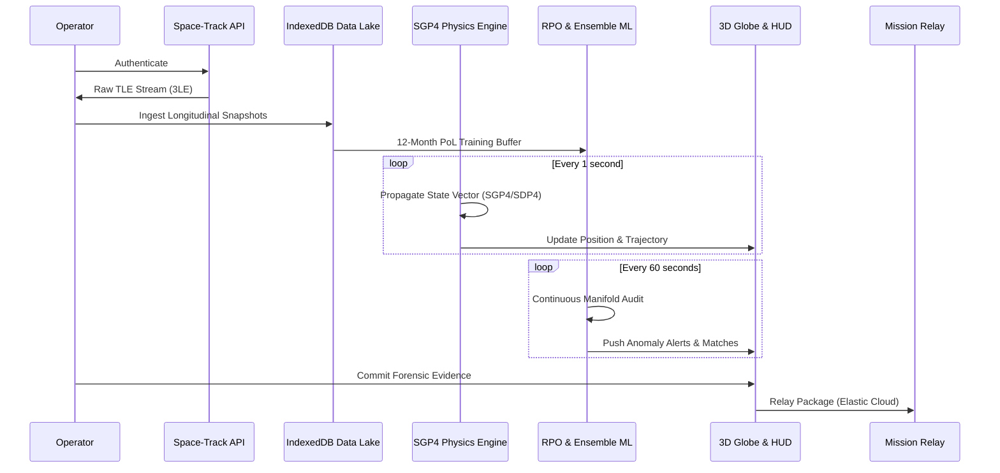

# OrbitWatch: Technical Documentation & System Architecture
**Version:** 3.9 // FULL FEATURE UPDATE
**Operational Date:** 3/10/2026

## Executive Summary
OrbitWatch is a high-fidelity Space Domain Awareness (SDA) platform designed for real-time monitoring, anomaly detection, and forensic attribution of orbital assets. By integrating a Tri-Model Neural Ensemble with a secure Elasticsearch intelligence relay, the platform provides mission operators with sub-minute precision in detecting non-nominal maneuvers, RPO engagements, and electronic warfare signatures.

## 1. System Architecture Overview
OrbitWatch is a decentralized, client-side Space Domain Awareness (SDA) platform. It executes all telemetry ingestion, physics propagation, ML inference, and forensic archival locally in the operator's browser using a "Stealth-Local" paradigm.

### 1.1 Tactical Data Flow

---

## 2. Orbital Dynamics & Trajectory Engine

### 2.1 Propagation Logic
The system utilizes the **Simplified General Perturbations (SGP4)** model for LEO and **SDP4** for Deep-Space (GEO) assets via the `satellite.js` library.
*   **Physics Sampling**: Every 1,000ms, the engine generates a Cartesian ECI position ($X, Y, Z$) and velocity ($vX, vY, vZ$).
*   **Trajectory Prediction**: To generate the **Orbital Trajectory Graph**, the engine propagates the state vector at $T \pm 90$ minute intervals. This creates a projected orbital path line visible in the Dynamics tab, allowing operators to visualize planned versus observed motion.

### 2.2 Numerical Attribution
*   **Velocity Delta ($Δv$)**: Calculated as the magnitude difference between the current epoch state and the historical mean.
*   **Nodal Migration**: Monitors rate of change in Right Ascension of the Ascending Node (RAAN) to detect unauthorized plane changes.

---

## 3. Pattern of Life (PoL) & Stability Manifold

### 3.1 Longitudinal Manifold Logic
OrbitWatch builds a **Pattern of Life (PoL)** for every asset using its last 12 months of station-keeping telemetry stored in the **IndexedDB Data Lake**.
*   **Stability Coefficient**: A measurement of an asset's station-keeping precision.
*   **Manifold Breach**: The system calculates a 3-Sigma ($σ3$) corridor. If the current TLE parameters deviate from this historical manifold, the "PoL Audit" flags a breach.

### 3.2 Stability Decay
As an asset ages or enters a maneuver phase, its stability score "decays." The **Neural Autoencoder** detects this decay by monitoring the **Reconstruction MSE**; a high error indicates the satellite is in a physics state it has never historically occupied.

---

## 4. RPO (Rendezvous and Proximity Operations) Engine

The **Geometric kNN** model is specifically tuned for RPO detection through "Manifold Synchronicity."

### 4.1 7D Proximity kNN
Unlike standard range-finders, OrbitWatch calculates proximity in a 7-dimensional behavioral space:
1.  **Inclination Sync** (Plane matching)
2.  **Mean Motion Sync** (Velocity matching)
3.  **RAAN Alignment** (Nodal matching)
4.  **Eccentricity Matching** (Orbit shape)
5.  **Argument of Perigee Sync**
6.  **Mean Anomaly Alignment**
7.  **Epoch Age Delta**

**Attribution Logic:** If an asset's 7D Euclidean distance to another RSO decreases while its AE Reconstruction Error spikes, the system triggers an **Active RPO Engagement** alert.

---

## 5. SIGINT Forensics & RF Spectrum Analysis

### 5.1 Doppler-Shifted PSD Analysis
The **RF Spectrogram** provides a real-time visualization of the asset's simulated signal environment.
*   **Center Frequency**: Derived from the base carrier plus the Doppler shift calculated from the satellite's instantaneous radial velocity ($v_{rel}$).
*   **Enhanced Spectrogram**: The graph plots Power Spectral Density (PSD) in dBm. 
*   **Tooltip Diagnostics**: Hovering over the spectrum reveals specific bin frequencies and noise floor metrics. 
*   **Jamming Detection**: If $Δv$ is high, the system simulates "Broadband Noise Injection," raising the noise floor from -112dBm to -85dBm, triggering an **EW Activity** flag.

---

## 6. Historical Signature Matcher

OrbitWatch maintains an internal **Historical Incident Reference Library** (e.g., SJ-21 Tug, Kosmos-2542). 
*   **Pattern Matching**: The system compares the current $Δv$ and Nodal Migration signature against documented historical events.
*   **Tactical Correlation**: If the maneuver profile matches a known incident (e.g., "Robotic RPO"), the UI explicitly identifies the case name and Case ID (CID).

---

## 7. Forensic Investigation Workflow

### 7.1 Commitment & Ledger Logic
When an operator clicks **"Commit to Forensic Ledger"**, the system executes the following:
1.  **Evidence Package Construction**: Captures a snapshot of current telemetry, ML component scores, SIGINT spectrum data, and framework classifications (MITRE/SPARTA).
2.  **Dossier Generation**: Creates a new entry in the `investigationService`. 
3.  **3-Sigma Audit**: Operators can upload historical TLE ledgers (CSV) to the dossier to perform a "Post-Hoc 3-Sigma Analysis," generating bell-curve visualizations of the deviation.
4.  **Mission Relay**: If the Relay is `LINKED`, the package is transmitted via the `server.js` middleware to an **Elasticsearch Cloud** ledger for multi-operator attribution and permanent record-keeping.

---
## 8. Conclusion
OrbitWatch provides a robust, physics-first approach to orbital attribution. By combining local edge-computing (Stealth-Local) with centralized intelligence synchronization, it ensures that mission operators have the highest fidelity data for maintaining space superiority. The integration of neural ensembles, SIGINT forensics, and tactical framework mapping standardizes the response to non-nominal orbital events, bridging the gap between raw data and strategic intelligence.

---
*Operational ID: OW-STEALTH-PROTCOL-V39 // FULL SYSTEM DOCUMENTATION // PHYSICS-FIRST ATTRIBUTION*
