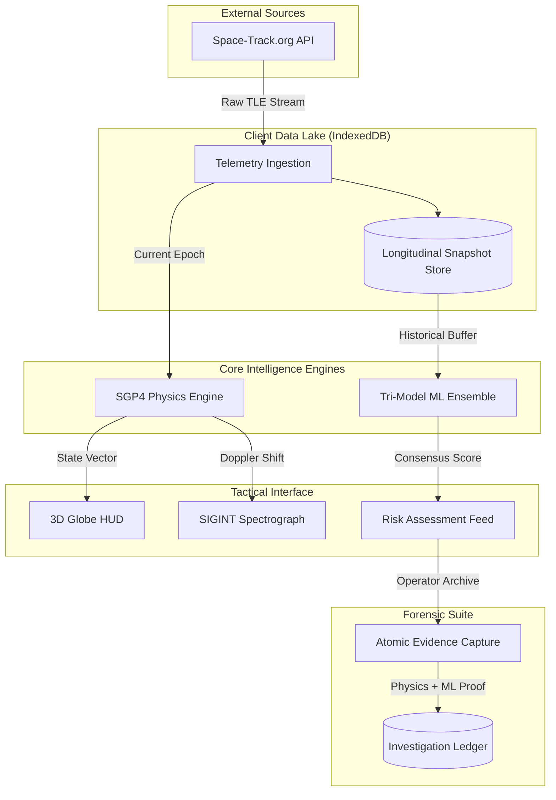

# OrbitWatch Tactical SDA Platform: Master Technical Specification
**Version:** 2025.04.v10 (Forensic Audit)  
**Classification:** MISSION SENSITIVE // SDA-OPERATIONAL // NOFORN

## 1. System Philosophy & Mission Profile
OrbitWatch is a specialized Space Domain Awareness (SDA) tool designed for the high-fidelity tracking and forensic attribution of anomalous Geostationary (GEO) assets. The platform utilizes a **"Stealth-Local"** architecture, ensuring that all data processing, physics propagation, and machine learning inference remain entirely within the client's local browser environment to maintain operational security and zero-latency visualization.

---

## 2. Comprehensive Technology Stack
The platform's performance and accuracy are driven by a modern, hardware-accelerated stack:

| Operational Layer | Technology | Purpose |
| :--- | :--- | :--- |
| **User Interface** | React 19 (TypeScript) | Reactive state management for high-frequency telemetry updates. |
| **Visual HUD** | Tailwind CSS | Custom high-contrast stealth styling for low-light environments. |
| **Global Visualization** | Three.js (react-globe.gl) | Hardware-accelerated 3D rendering of the orbital regime. |
| **Physics Core** | satellite.js (SGP4/SDP4) | Real-world orbital mechanics and coordinate transformations. |
| **Intelligence Suite** | TensorFlow.js (WebGL) | GPU-accelerated local machine learning ensemble. |
| **Forensic Storage** | IndexedDB / LocalStorage | Decentralized persistence for longitudinal analysis and mission logs. |
| **Data Analytics** | Recharts (SVG) | Precision spectrography and trajectory trend visualization. |

---

## 3. System Architecture

<div align="center">


**Figure 1.0:** *OrbitWatch Integrated Data Pipeline and Intelligence Flow*
</div>

### 3.1 Longitudinal Behavior Analysis & Snapshot Engine
Unlike standard tracking tools that only process the "latest" data, OrbitWatch utilizes a **Temporal Snapshot Engine** located in `databaseService.ts`.
- **Atomic Snapshots:** Every synchronization event saves a `CatalogSnapshot` object. This captures the entire GEO belt's state at that specific timestamp.
- **The Training Buffer:** Upon initialization, the system calls `dbService.getTrainingDataset(5)`. This retrieves the 5 most recent snapshots (roughly 1,500–2,000 records). 
- **Learning Nominal Motion:** By training the ML ensemble on this historical buffer, the system builds a statistical "Steady-State" manifold. This allows it to detect when a satellite's *current* TLE (Two-Line Element) has deviated from its own historical station-keeping pattern or its cohort's expected trajectory.

---

## 4. Deep-Dive: Tri-Model ML Ensemble (`tensorFlowService.ts`)

The intelligence suite utilizes three independent architectures to calculate a weighted risk consensus.

### 4.1 Model A: Neural Autoencoder (Structural Deviation)
Learns the compressed representation (manifold) of "Normal" satellite behavior using a bottleneck architecture.
```typescript
const model = tf.sequential();
model.add(tf.layers.dense({ units: 14, activation: 'tanh', inputShape: [7] }));
model.add(tf.layers.dense({ units: 8, activation: 'relu' }));
model.add(tf.layers.dense({ units: 3, activation: 'relu' })); // Latent Bottleneck
model.add(tf.layers.dense({ units: 8, activation: 'relu' }));
model.add(tf.layers.dense({ units: 14, activation: 'tanh' }));
model.add(tf.layers.dense({ units: 7, activation: 'linear' }));
```
- **Operational Logic:** It measures **Reconstruction MSE**. A high error indicates the satellite's 7D features have deviated from the learned "Normal" flight style of its orbital class.

### 4.2 Model B: Isolation Forest (Statistical Outliers)
Isolates anomalies by measuring how quickly an instance can be separated from the rest of the population.
```typescript
private pathLength(instance: number[], node: IsolationTree, currentPathLength: number): number {
    if (node.isExternal) return currentPathLength + this.cFactor(node.size);
    if (instance[node.splitFeature] < node.splitValue) {
        return this.pathLength(instance, node.left!, currentPathLength + 1);
    } else {
        return this.pathLength(instance, node.right!, currentPathLength + 1);
    }
}
```
- **Operational Logic:** Anomalies (outliers) typically reside in sparse regions of the orbital space, leading to shorter traversal paths in the decision trees.

### 4.3 Model C: Geometric kNN (Proximity Analysis)
Detects Rendezvous and Proximity Operations (RPO) by measuring geometric distance to nearest neighbors.
```typescript
const diff = this.referenceData!.sub(xNorm);
const squaredDiff = diff.square();
const sumSquaredDiff = squaredDiff.sum(1);
const distances = sumSquaredDiff.sqrt();
const { values } = distances.neg().topk(this.k); // Find k-nearest
const meanDistance = values.neg().mean().dataSync()[0];
```
- **Operational Logic:** If the distance to neighbors is significantly smaller than the historical average, the system flags a "Close-Approach" threat.

---

## 5. Master Ensemble Scoring (`Consensus Layer`)
The system avoids single-point failure by weighting the three models into a final probability score.

```typescript
// Consensus Weighting Logic
const aeNorm = Math.min(1, aeScore * 2); // Normalize reconstruction loss
const ensembleProbability = (aeNorm * 0.4) + (ifScore * 0.3) + (knnScore * 0.3);
let riskScore = Math.floor(ensembleProbability * 100);

// Physics-Based Dampening (Filter)
if (age > 15) riskScore *= 0.8; // Reduce noise from known old debris
```
- **Logic Explanation:** The Neural Model (40%) identifies complex behavioral shifts; the Isolation Forest (30%) identifies statistical population shifts; and kNN (30%) identifies physical geometric threats. 

---

## 6. SIGINT & RF Forensic Engine
The **Signal Analysis** suite provides a high-fidelity transponder simulation based on captured physics:
- **Doppler Shift:** $f_{shifted} = f_{base} \times (1 + v/c)$. Center frequency peaks move left/right based on the SGP4-derived velocity magnitude.
- **Path Loss:** RSSI is attenuated using the inverse square law relative to the SGP4-derived altitude.
- **Jamming Simulation:** If risk exceeds 70%, the spectrograph injects **Broadband Noise Injection**, visually obscuring the signal peak to simulate hostile interference.

---

## 7. Investigation Ledger (Attribution Proof)
The Investigation Suite is the platform's "Black Box." 
- **Non-Simulated Logs:** When a case is created, the `investigationService` captures the current state vector.
- **Forensic Snapshot:** Altitude, Velocity, and Model Scores are frozen as hard evidence. 
- **Tactical Frameworks:** Each dossier entry explicitly includes **MITRE ATT&CK for Space** and **SPARTA** classifications to provide standardized attribution across mission partners.
- **Operator Attribution:** Manual notes are permanently appended to the dossier, creating an immutable mission record.
