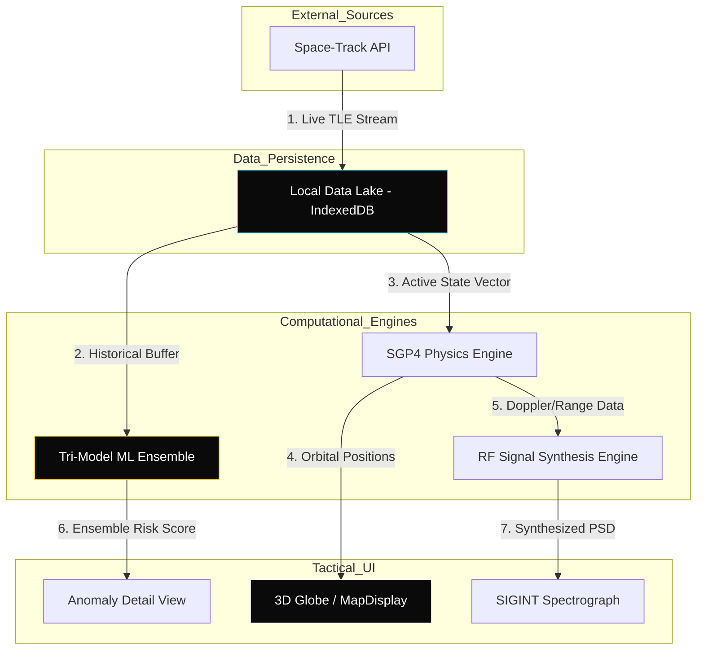
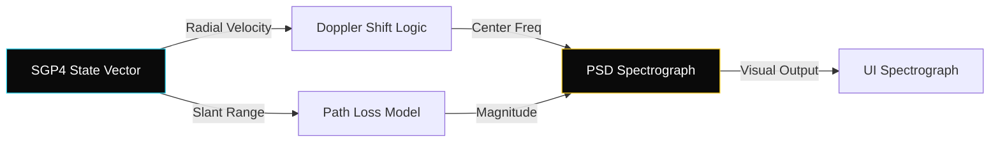
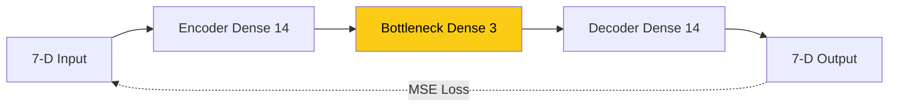

# OrbitWatch Tactical SDA Platform: Technical Specification
**By: Ritvik Indupuri**  
**Date: 12/24/2025**

## Table of Contents
1.  [Executive Summary](#executive-summary)
2.  [System Architecture & Operational Flow](#2-system-architecture--operational-flow)
3.  [Data Lake Architecture & Ingestion](#3-data-lake-architecture--ingestion)
4.  [RF Signal Analysis & SIGINT Synthesis](#4-rf-signal-analysis--sigint-synthesis)
    *   4.1 [Variable Provenance & Attribution](#41-variable-provenance--attribution)
    *   4.2 [The Mathematical Synthesis Pipeline](#42-the-mathematical-synthesis-pipeline)
    *   4.3 [Spectrograph Visualization Logic](#43-spectrograph-visualization-logic)
    *   4.4 [Electronic Warfare (EW) Anomaly Detection](#44-electronic-warfare-ew-anomaly-detection)
5.  [SGP4/SDP4 Orbital Propagation Engine](#5-sgp4sdp4-orbital-propagation-engine)
6.  [Machine Learning Ensemble Training](#6-machine-learning-ensemble-training)
7.  [Conclusion](#conclusion)

---

## Executive Summary
OrbitWatch is an advanced Space Domain Awareness (SDA) platform designed to identify and attribute anomalous behavior in the Geostationary (GEO) belt. The platform leverages a decentralized architecture, moving heavy computation to the tactical edge. By integrating high-fidelity physics with a tri-model ML ensemble, OrbitWatch provides a 1:1 digital twin of the orbital environment capable of detecting cyber-kinetic threats in real-time.

---

## 2. System Architecture & Operational Flow

The OrbitWatch architecture is designed to minimize latency by localizing the "Intelligence Core." All processing—from physics propagation to neural network inference—happens within the operator's browser session.

  <b>FIGURE 1: SYSTEM ARCHITECTURE & DATA SYNERGY</b> 

**Transition**: *With the high-level architecture defined, we move to the foundational layer that powers these flows: the Local Data Lake.*

---

## 3. Data Lake Architecture & Ingestion

The Local Data Lake acts as the platform's "Single Source of Truth," replacing cloud-based databases with a localized **IndexedDB** instance.

### 3.1 Ingestion & Longitudinal Snapshots
The system performs automated background synchronization every **60 seconds**. Each "snapshot" captures the state of ~300 GEO assets. 
*   **Persistent Indexing**: Every ingested TLE is indexed by `NORAD_CAT_ID` and `TIMESTAMP`.
*   **Buffer Management**: The system maintains the last **5 historical snapshots** (approx. 3,000 records) to provide a longitudinal training set for the ML models, ensuring they account for natural gravitational perturbations.

**Transition**: *Once the data is securely localized, the platform begins simulating the electromagnetic environment of these assets through SIGINT synthesis.*

---

## 4. RF Signal Analysis & SIGINT Synthesis

The RF Signal Analysis engine models how a satellite's physical motion manifests as an electromagnetic signature. It provides a real-time Power Spectral Density (PSD) spectrograph that allows operators to "hear" the orbital environment.

### 4.1 Variable Provenance & Attribution
To maintain 1:1 physical fidelity, every variable in the RF model is derived from the **SGP4 State Vector** and **Mission Metadata**.

| Variable | Definition | Mathematical Provenance |
| :--- | :--- | :--- |
| **$f_c$** | Center Frequency | S-Band (2.2 GHz) for standard telemetry; Ku-Band (12.0 GHz) for high-bandwidth Starlink/Comms. |
| **$v_{radial}$** | Radial Velocity | Calculated as the 3D magnitude ($\|\vec{v}\|$) of the velocity vector produced by the SGP4 engine. |
| **$d$** | Slant Range | The scalar Euclidean distance from the ground observer coordinates to the satellite's ECI position ($\vec{r}$). |
| **$c$** | Speed of Light | Constant: $299,792,458$ m/s. |

### 4.2 The Mathematical Synthesis Pipeline
The engine executes three sequential calculations every 1000ms:

1.  **Doppler Shift Calculation**: Radial velocity causes a frequency compression or expansion.
    $$f_{obs} = f_c \left(1 + \frac{v_{radial}}{c}\right)$$
2.  **Free-Space Path Loss (FSPL)**: The signal power attenuates over distance $d$ and frequency $f$.
    $$FSPL (dB) = 20 \log_{10}(d) + 20 \log_{10}(f) + 92.45$$
3.  **Received Signal Strength (RSSI)**: Assuming a standard transmitter power ($P_{tx}$) of 60 dBm for GEO assets:
    $$RSSI = 60 - FSPL$$

### 4.3 Spectrograph Visualization Logic
The PSD plot is generated by sampling 150 frequency bins around the calculated $f_{obs}$.
*   **The Signal Peak**: Modeled as a Gaussian distribution centered at $f_{obs}$ with a narrow standard deviation to simulate a stable carrier lock.
*   **The Noise Floor**: A baseline thermal noise ($N_o$) is modeled at -115.0 dBm with a random $\pm 2.5$ dB variance to simulate atmospheric scintillation.

  <b>FIGURE 2: SIGINT SPECTRAL SYNTHESIS PIPELINE</b> 

### 4.4 Electronic Warfare (EW) Anomaly Detection
The RF engine identifies anomalies by monitoring the relationship between the **Calculated Noise Floor** and the **Observed Signal Peak**.

*   **Broadband Jamming Detection**: Triggered when the noise floor across all 150 frequency bins rises by $>25$ dB. In the UI, this manifests as a "Broadband Overlay" warning with a red spectral fill.
*   **Spot Jamming Detection**: Identified when a second, high-power Gaussian peak appears that is NOT synchronized with the SGP4-predicted Doppler shift.
*   **Logic Link**: If the ML Ensemble (Section 6) reports a high risk score *simultaneously* with an RF noise floor elevation, the system upgrades the anomaly to **CRITICAL: HOSTILE INTERFERENCE**.

**Transition**: *The accuracy of these spectral signatures depends entirely on the precision of the underlying orbital propagator, which provides the range and velocity vectors.*

---

## 5. SGP4/SDP4 Orbital Propagation Engine

The SGP4 engine is the "Physics Core" of OrbitWatch, responsible for translating TLE mean elements into 3D Cartesian space.

### 5.1 Historical Back-Propagation ($t < 0$)
To detect past maneuvers, the engine runs in a "Negative Temporal Mode."
*   **Logic**: The system calculates the state vector for $T-24H$. If the resulting ballistic position deviates significantly from the *actual* historical record in the Data Lake, a maneuver is flagged.

### 5.2 Forecasting & RPO Prediction ($t > 0$)
The engine also projects forward to identify future threats.
*   **Logic**: Propagating to $T+1H$ allows the system to calculate the "Relative Distance" between two converging assets.

**Transition**: *While the Physics Engine defines ballistic norms, identifying deliberate hostile behavior requires the nuanced pattern recognition of the ML Ensemble.*

---

## 6. Machine Learning Ensemble Training

OrbitWatch utilizes a Tri-Model approach to ensure robust detection. All models are trained using **TensorFlow.js** on the localized training set retrieved from the Data Lake.

### 6.1 Model A: Deep Autoencoder (Neural Reconstruction)
*   **How it Works**: A Sequential neural network that learns to compress and reconstruct 7-D state vectors.
*   **Architecture**: I[7-D] -> E[14] -> B[3] -> D[14] -> O[7-D].

  <b>FIGURE 3: AUTOENCODER NEURAL ARCHITECTURE</b> 

### 6.2 Model B: Isolation Forest (Statistical Density)
*   **How it Works**: A tree-based ensemble that partitions the parameter space into 100 independent trees.

### 6.3 Model C: k-Nearest Neighbors (Geometric Proximity)
*   **How it Works**: Calculates Euclidean distance to the 5 nearest neighbors in the feature space.

---

## Conclusion
The logical integration of localized data, high-fidelity physics, and a tri-model ensemble allows OrbitWatch to attribute space threats with unprecedented speed. By following this technical pipeline—from ingestion to spectral analysis and finally into the "Intelligence Core"—the platform ensures the operator is always ahead of the threat cycle.

## Conclusion
The logical integration of localized data, high-fidelity physics, and a tri-model ensemble allows OrbitWatch to attribute space threats with unprecedented speed. By following this technical pipeline—from ingestion to spectral analysis and finally into the "Intelligence Core"—the platform ensures the operator is always ahead of the threat cycle.
