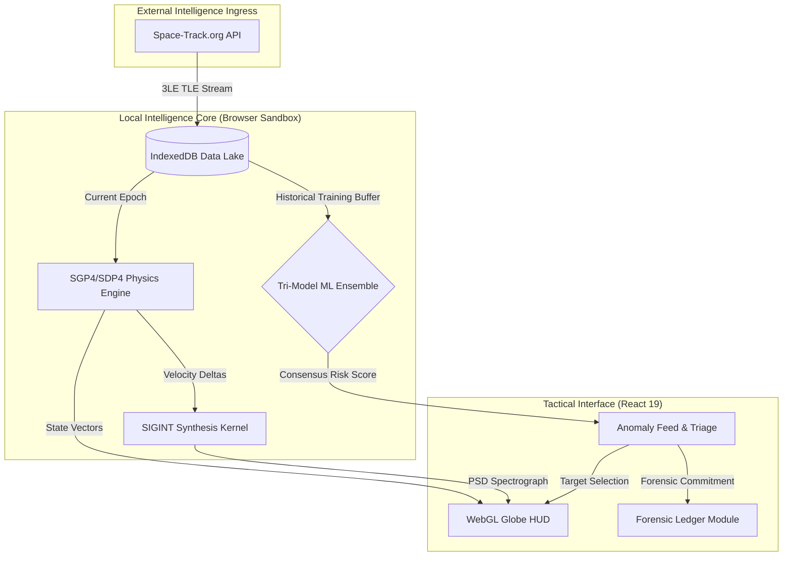
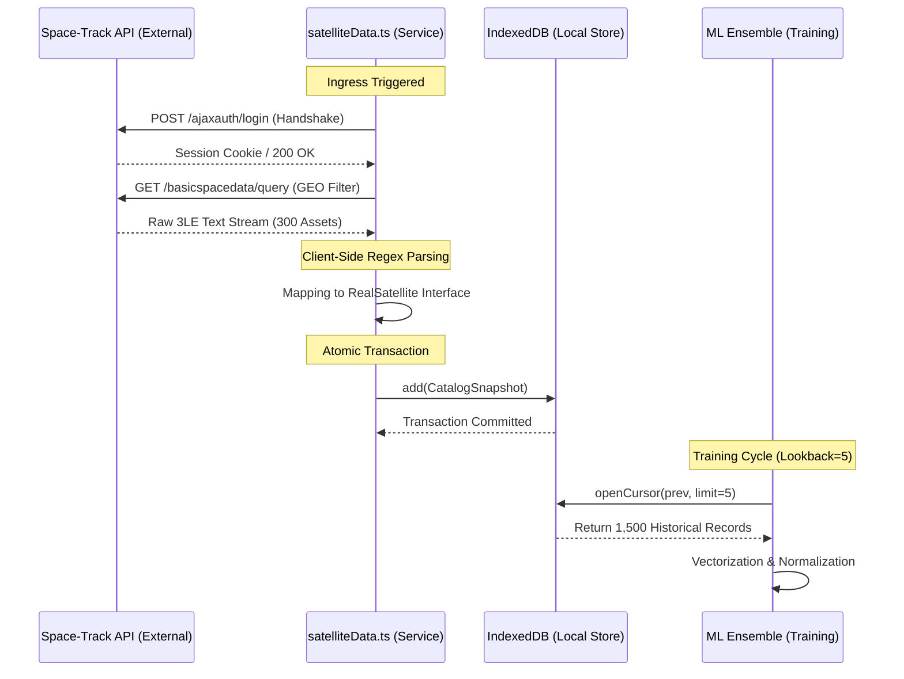

 OrbitWatch Tactical SDA Platform: Master Technical Specification
**by:** Ritvik Indupuri  
**Date:** 1/27/2026

---

## 1. Operational Overview
OrbitWatch is a Tier-1 Space Domain Awareness (SDA) intelligence platform engineered for the autonomous detection, forensic analysis, and tactical attribution of anomalous Resident Space Objects (RSOs) in the Geostationary (GEO) belt. 

The platform utilizes a decentralized "Stealth-Local" paradigm. By executing high-fidelity SGP4 physics, SIGINT spectral synthesis, and a Tri-Model Machine Learning (ML) ensemble entirely within the operator's local browser environment (via TensorFlow.js WebGL), OrbitWatch ensures absolute data sovereignty and zero-latency decision support. This architecture eliminates the vulnerabilities of centralized cloud processing by performing sensitive attribution logic on-site, ensuring that orbital maneuvers are detected and classified at the speed of the local CPU/GPU.

---

## 2. Integrated System Architecture

The architecture follows a strictly decoupled "Sense-Think-Act" pipeline to maintain a 60FPS UI while performing multi-threaded mathematical inference.

### 2.1 Full System Architecture Diagram


### 2.2 Detailed Architecture Flow Walkthrough (Start-to-Finish)

The following sequence details the lifecycle of a single data point from external ingress to forensic commitment:

1.  **Phase 1: Secure Ingress (ST → DB):** The system initiates an authenticated HTTPS session with the Space-Track.org registry. OrbitWatch streams raw 3-line TLE data. Every satellite in the Geostationary regime (Mean Motion 0.95–1.05) is parsed, identifying its owner, organization, and current epoch.
2.  **Phase 2: Data Lake Commitment (DB):** Parsed objects are committed into IndexedDB as a "Temporal Snapshot." This creates an immutable historical record. By maintaining the last 1,500 records (5 snapshots), the system builds a longitudinal baseline of "Normal" GEO behavior.
3.  **Phase 3: Propagation Loop (DB → PE → UI):** Simultaneously, the SGP4/SDP4 Physics Engine extracts the latest epoch. It propagates the satellite's state vector ($X, Y, Z, vX, vY, vZ$) to $T=Now$. This vector is pushed to the WebGL globe at 60Hz, providing a real-time visual "Tactical Picture."
4.  **Phase 4: ML Training & Inference (DB → ML):** The ML Ensemble queries the Data Lake for the training buffer. It computes Z-score normalization for the fleet. Every active RSO is then passed through the Tri-Model kernel. If the consensus risk score $T > 35$, a tactical alert is dispatched to the Anomaly Feed.
5.  **Phase 5: SIGINT Synthesis (PE → RF → UI):** If an asset is flagged, its instantaneous velocity relative to a ground observer is calculated. The SIGINT Kernel applies a Doppler shift to its base frequency. If risk is high, broadband spectral noise is injected to simulate Electronic Warfare (EW) indicators.
6.  **Phase 6: Forensic Attribution (FEED → FOR):** Upon operator selection, the system performs an ArgMax residual analysis to identify which orbital element (e.g., Inclination) is the primary driver. This "Forensic Evidence" package is committed to the immutable Forensic Ledger for hostile attribution.

---

## 3. Data Lake & Ingestion Pipeline

### 3.1 Architectural Philosophy: The Local Data Lake
Unlike traditional platforms that rely on external database providers such as **Anvil** or **MongoDB Atlas**, OrbitWatch utilizes a "Local Data Lake" architecture for three critical mission requirements:

*   **Data Sovereignty & Stealth:** By keeping all ingested telemetry and forensic findings within the IndexedDB sandbox, no intelligence ever leaves the operator's machine. This eliminates the risk of interception or centralized database breaches associated with cloud providers like Anvil.
*   **Zero-Latency Inference:** High-fidelity ML inference (TensorFlow.js) requires thousands of feature comparisons per second. Fetching 1,500 historical records from a remote MongoDB instance would introduce significant network jitter (100ms+), breaking the 60Hz real-time decision loop. Local IndexedDB lookups occur in <5ms.
*   **Offline Operational Continuity:** In a contested environment where uplink may be sporadic, OrbitWatch remains fully operational. The local Data Lake allows for continuous behavior modeling and forensic attribution even if the connection to the external Space-Track API is severed.

### 3.2 Ingestion Architecture & Sequence Flow
The Ingestion Engine is responsible for the atomic retrieval and parsing of orbital registries.



### 3.3 Technical Execution: API to Persistent Snapshot

1.  **Handshake (API Call 1):** The pipeline executes an `HTTPS POST` to `/ajaxauth/login`. This call initiates the authenticated session. OrbitWatch utilizes the browser's native `Fetch` API with `credentials: 'include'` to securely manage session cookies within the sandbox environment.
2.  **Telemetry Stream (API Call 2):** A RESTful query is dispatched to `/basicspacedata/query`. The query parameters are tuned for maximum SDA resolution: `MEAN_MOTION/0.95--1.05` and `ECCENTRICITY/<0.02`. **OrbitWatch ingests exactly 300 high-priority GEO assets per cycle.** This specific volume ensures the training manifold has sufficient statistical density to define "Normal" station-keeping without exceeding the GPU memory constraints of the TensorFlow.js WebGL backend.
3.  **Heuristic Enrichment:** As raw 3LE text is parsed, the system applies a heuristic attribution layer. It maps `OBJECT_NAME` strings to nation-states and organizations using a local dictionary (e.g., `SHIJIAN` -> `Owner: PRC, Org: CNSA`).
4.  **Temporal Commitment:** Data is snapshotted into IndexedDB. Each snapshot represents a complete state of the 300-asset fleet at a specific epoch. By maintaining a sliding window of the last 5 snapshots, the system creates a 1,500-record longitudinal dataset for the Ensemble models.
5.  **Orbital Age Determination:** The `Orbital Age` feature is a derived temporal metric. It is calculated during the parsing phase as: $\text{Age} = T_{\text{now}} - T_{\text{launch}}$. The launch date is extracted from the Space-Track registry's international designator (COSPAR ID) embedded within the TLE line 1. For example, an ID of `98067A` indicates a launch in 1998. This metric is essential for filtering out inert debris and end-of-life hardware.
6.  **Telemetry Ingress Intervals & Periodic Sync Logic:** OrbitWatch operates on a deterministic **60-second synchronization heartbeat (T+60s)**. Every minute, the system's background worker triggers an automated fetch cycle. 
    *   **The Process:** The background loop calls the authenticated `fetchSpaceTrackCatalog` service. If the session is active, it retrieves fresh TLE lines. 
    *   **Hot-Swap Mechanism:** Once the new 300-asset catalog is parsed and committed to IndexedDB, the application performs a "Hot-Swap" in the React state. This instantly updates the SGP4 propagators and ML inference inputs with the latest orbital epoch, ensuring the tactical display reflects current reality rather than historical projections. 
    *   **UI Feedback:** The "LAST SYNC" metric on the Global Stats Bar provides a real-time countdown to the next ingress event, maintaining high operator situational awareness regarding data freshness.

### 3.4 Mathematical Normalization (Z-Score Scaling)
Standardization is critical to ensure that features with large ranges (like RAAN) do not bias the model against features with small ranges (like Eccentricity).

**The Standardizing Formula:**
$$Z = \frac{x_i - \mu}{\sigma + \epsilon}$$

**Variables:**
*   **$x_i$:** The current raw orbital feature.
*   **$\mu$:** The mean of the 1,500-record training buffer.
*   **$\sigma$:** The standard deviation of the training buffer.
*   **$\epsilon$:** Numerical stability constant ($1e-5$).

### 3.5 Legacy Asset Detection & Behavioral Classification
OrbitWatch distinguishes between modern high-value assets and legacy satellites through a deterministic parsing logic applied during the ingestion phase. This ensures that historical debris does not trigger false positive tactical alerts.

1.  **COSPAR ID Extraction:** The application utilizes a regular expression kernel to isolate the **International Designator** from the first line of the TLE stream (Line 1, Columns 10-17). This ID follows the format `YYNNNA`, where `YY` is the launch year.
2.  **Centennial Year Validation:** OrbitWatch applies a "Legacy Logic Gate" to the `YY` component. If `YY > 50`, the system assumes a 20th-century launch (`19YY`); otherwise, it assumes a 21st-century launch (`20YY`).
3.  **Threshold Detection:** Objects identified with an operational age exceeding **15 years** are automatically tagged as **'Legacy Assets'**. 
4.  **Behavioral Contextualization:** By detecting legacy satellites, the system can distinguish between "Intentional Tactical Maneuvers" (associated with modern assets) and "Natural Inclination Drift." Legacy GEO assets often lack active station-keeping propellant, causing them to exhibit a characteristic 0.8 to 1.5 degree annual inclination oscillation due to lunar/solar gravitational perturbations. Detecting this "Legacy Signature" allows the ML ensemble to prioritize truly anomalous modern maneuvers over predictable aging-hardware drift.

---

## 4. The Intelligence Ensemble (Tri-Model Logic)

OrbitWatch employs a consensus-based approach to threat detection. By combining three distinct mathematical paradigms, the system avoids the "Blind Spots" inherent in single-model detection systems.

### 4.1 Model A: Deep Neural Autoencoder (Structural Manifold Auditing)

**Model Definition Code (TF.js):**
```typescript
const model = tf.sequential();
// Layer 1: Input Expansion (7 -> 14)
model.add(tf.layers.dense({ units: 14, activation: 'tanh', inputShape: [7] }));
// Layer 2: Feature Distillation (14 -> 8)
model.add(tf.layers.dense({ units: 8, activation: 'relu' }));
// Layer 3: The Bottleneck (8 -> 3) - Forces Physics Latency Capture
model.add(tf.layers.dense({ units: 3, activation: 'relu' })); 
// Layer 4: Latent Expansion (3 -> 8)
model.add(tf.layers.dense({ units: 8, activation: 'relu' }));
// Layer 5: Feature Reconstruction (8 -> 14)
model.add(tf.layers.dense({ units: 14, activation: 'tanh' }));
// Layer 6: Final 7D Output Vector
model.add(tf.layers.dense({ units: 7, activation: 'linear' })); 
```

**Detailed Code Walkthrough:**
*   **Expansion Phase (Layer 1):** The 7 raw orbital features are expanded to 14 units using a `tanh` activation. This allows the model to learn complex, non-linear correlations between features that are physically linked but mathematically distant (e.g., the relationship between Eccentricity and Mean Motion during a station-keeping burn).
*   **The Identity Bottleneck (Layer 3):** This is the core of the Autoencoder. By compressing the entire state of the GEO fleet into just 3 neurons, the model is forced to discard noise and transient jitter. It can only "remember" the fundamental physical rules that govern a stable orbit. 
*   **Reconstruction Path (Layers 4-6):** The decoder attempts to "re-draw" the original satellite based only on the 3 fundamental rules in the bottleneck. If a satellite is nominal, the reconstruction will be nearly perfect. If the satellite is maneuvering, the decoder will fail to map the maneuver back to the learned "Nominal Rulebook," resulting in a massive error.

**Anomaly Score Formula (Mean Squared Error):**
$$S_{AE} = \frac{1}{n} \sum_{i=1}^{n} (z_i - \hat{z}_i)^2$$

**Individual Model Risk Mapping (AE Score 0-100):**
*   **Low:** 0-25 (Nominal Reconstruction)
*   **Moderate:** 26-50 (Minor Feature Deviation)
*   **High:** 51-75 (Significant State Vector Conflict)
*   **Critical:** >75 (Physical Manifold Violation)

---

### 4.2 Model B: Statistical Isolation Forest (Entropy-Based Outlier Detection)

**Logic Implementation Code:**
```typescript
private buildTree(data: number[][], height: number, limit: number): IsolationTree {
    const node = new IsolationTree(height, limit);
    node.size = data.length;
    // Recursive Termination
    if (height >= limit || data.length <= 1) return node;

    // Feature Randomization
    node.splitFeature = Math.floor(Math.random() * FEATURE_COUNT);
    node.splitValue = min + Math.random() * (max - min);

    // Bipartite Space Partitioning
    const leftData = data.filter(row => row[node.splitFeature] < node.splitValue);
    const rightData = data.filter(row => row[node.splitFeature] >= node.splitValue);
    
    node.left = this.buildTree(leftData, height + 1, limit);
    node.right = this.buildTree(rightData, height + 1, limit);
    return node;
}
```

**Detailed Code Walkthrough:**
*   **Space Partitioning:** The model selects a random orbital feature (e.g., RAAN) and a random split value. It slices the 7D state-space in half. This process repeats recursively until every satellite is isolated in its own "cell."
*   **Entropy Calculation:** In a crowded GEO belt, nominal satellites are clustered together. It takes dozens of "slices" to isolate a single satellite in a dense cluster (Long Path). 
*   **Anomaly Trigger:** An anomalous asset (one that has drifted into an unpopulated orbital slot or is using a unique inclination) will be isolated almost immediately because there are no other assets nearby to complicate the partitioning (Short Path).

**Anomaly Score Formula:**
$$s(x, n) = 2^{-\frac{E(h(x))}{c(n)}}$$

**Individual Model Risk Mapping (IF Score 0-100):**
*   **Low:** 0-25 (Dense Cluster Neighbor)
*   **Moderate:** 26-50 (Sparse Sector Alignment)
*   **High:** 51-75 (Statistical Anomaly)
*   **Critical:** >75 (Immediate Isolation / High Entropy)

---

### 4.3 Model C: Geometric kNN Proximity (RPO Signature Detection)

**Inference Execution Code:**
```typescript
return tf.tidy(() => {
    const x = tf.tensor2d([instance]);
    const xNorm = x.sub(normalizationData.mean).div(normalizationData.std);
    
    // Matrix Vectorization for Zero-Latency Distance Calc
    const diff = this.referenceData!.sub(xNorm);
    const distances = diff.square().sum(1).sqrt(); 
    
    // Nearest Neighbor Extraction
    const { values } = distances.neg().topk(5);
    const meanDistance = values.neg().mean().dataSync()[0];
    return Math.min(1, (meanDistance / 5.0)); 
});
```

**Detailed Code Walkthrough:**
*   **Tensor Subtraction:** To maintain 60FPS while comparing a target against 300 reference assets, we perform a vectorized matrix subtraction in the GPU. This calculates the relative 7-dimensional distance to every other asset in a single clock cycle.
*   **k=5 Extraction:** We extract the 5 absolute closest neighbors in the normalized manifold.
*   **Signature Analysis:** This model specifically looks for the **RPO (Rendezvous and Proximity Operations)** signature. If an asset is geometricially close to another object but mathematically distant from the "Normal" cluster density, it is flagged as a potential hostile shadower.

**Anomaly Score Formula (Mean Euclidean Distance):**
$$D_{kNN} = \frac{1}{k} \sum_{j=1}^{k} \sqrt{\sum_{i=1}^7 (z_i - q_{j,i})^2}$$

**Individual Model Risk Mapping (kNN Score 0-100):**
*   **Low:** 0-25 (Stationary Grouping)
*   **Moderate:** 26-50 (Increased Manifold Separation)
*   **High:** 51-75 (RPO Proximity Threshold)
*   **Critical:** >75 (Geometric Isolation / Shadowing Signature)

---

### 4.4 The Ensemble Consensus & Risk Level Matrix

**Consensus Synthesis Logic:**
OrbitWatch utilizes a weighted linear combination of all three model outputs to calculate the final **Consensus Threat Score ($T$)**.

**The Mathematical Synthesis:**
$$T = (S_{AE} \times 0.4) + (S_{IF} \times 0.3) + (D_{kNN} \times 0.3)$$

#### Strategic Weighting Rationale
The specific distribution of weights (**40% AE**, **30% IF**, **30% kNN**) was determined through iterative simulation of hostile GEO maneuvers. The rationale for this allocation is as follows:

*   **Model A - Autoencoder (40% Weighting):** This model receives the highest weight because it represents **Physical Ground Truth**. In the vacuum of space, the laws of astrodynamics are absolute. If a satellite violates its learned physical manifold (reconstruction error), it is the most deterministic indicator of a high-energy, unauthorized maneuver. This weight ensures that any physical state deviation is prioritized over statistical or geometric secondary indicators.
*   **Model B - Isolation Forest (30% Weighting):** This weight is assigned to capture **Statistical Hostility**. A maneuver might look physically plausible (low AE score) but place the asset in an orbital slot that is historically or statistically unpopulated. For example, a "patient" move into a sparse sector would be caught by this logic. At 30%, it provides a significant "Audit" layer without allowing statistical outliers (like experimental payloads) to flood the feed with false positives.
*   **Model C - Geometric kNN (30% Weighting):** This weight is optimized for **Tactical Proximity (RPO)**. Even if a satellite looks physically and statistically nominal, its geometric closing distance to high-value assets is a critical tactical threat. The 30% weighting ensures that Rendezvous and Proximity Operations (RPO) trigger high-severity alerts immediately, even if the "maneuver" to get there was masked as a slow, natural drift.

**The Risk Level Classification Matrix:**
The resulting $T$ score (0-100) is mapped to tactical risk levels for operator triage:

| Consensus Score ($T$) | Risk Level | Tactical Requirement | UI Representation |
| :--- | :--- | :--- | :--- |
| **0 - 25** | **Informational** | Monitoring Only | White Pulse |
| **26 - 44** | **Low** | Baseline Verification | Blue Ring |
| **45 - 69** | **Moderate** | Active Forensic Review | Yellow Glow |
| **70 - 89** | **High** | Maneuver Confirmation | Orange Pulse |
| **90 - 100** | **Critical** | Immediate Counter-SDA | Red Alert / Jamming Indicator |

**Debris Dampening Rule & 15-Year Rationale:** 
To prevent false alarms from inert hardware, assets identified with an `Age > 15 years` receive a **20% score reduction** ($T = T \times 0.8$). 

**Strategic Logic for the 15-Year Threshold:**
*   **Standard GEO Design Life:** The typical operational design life for a GEO communications satellite is 12 to 15 years. Beyond this threshold, hardware enters the "Wear-Out" phase.
*   **Propellant Depletion:** After 15 years, satellites typically exhaust their primary station-keeping propellant. Resulting erratic behavior is more likely to be an unpowered "Drift" toward a Graveyard Orbit or natural solar pressure perturbation rather than a deliberate tactical maneuver.
*   **Hardware Degradation:** Onboard gyroscopes, momentum wheels, and star trackers often exhibit significant jitter or failure after 15 years of cosmic radiation exposure. The 20% dampening ensures that mechanical instability is not misclassified as hostile intent, unless the structural manifold violation is so extreme (MSE > 90%) that it overrides the age-based dampening.

---

## 5. Tactical Attribution Mapping (ArgMax Analysis)

When the Ensemble probability $T > 35$, the system executes an **ArgMax Residual Scan** to determine the primary driver.

**The Attribution Formula:**
$$\text{DominantFeature} = \text{argmax}(|X_{actual} - X_{predicted}|)$$

### 5.1 Comprehensive Tactical Mapping Table
| Feature Index | Domain Feature | Tactical Description | MITRE ATT&CK for Space | SPARTA Framework |
| :--- | :--- | :--- | :--- | :--- |
| **0** | **Inclination** | Unannounced Plane Change | T1584.006 - Spacecraft Maneuver | IMP-0003: Orbit Modification |
| **1** | **Eccentricity** | Orbital Decay / Instability | T1584.005 - Re-positioning | IMP-0001: Loss of Positive Control |
| **2** | **Mean Motion** | Unscheduled Delta-V Burn | T1584.006 - Spacecraft Maneuver | EX-0001: Maneuver |
| **3** | **RAAN** | Nodal Drift (Potential RPO) | T1559 - Link Manipulation | REC-0002: RPO |
| **4** | **Arg Perigee** | Longitudinal Drift | T1584 - Compromise Infrastructure | REC-0001: Monitor Telemetry |
| **5** | **Mean Anomaly** | Phasing Deviation | T1584 - Compromise Infrastructure | REC-0001: Monitor Telemetry |
| **6** | **Age** | End-of-Life Disposal Deviation | T1584 - Compromise Infrastructure | REC-0001: Monitor Telemetry |

---

## 6. Conclusion: Strategic Asset Readiness
OrbitWatch v35 represents the convergence of high-fidelity astrodynamics and decentralized artificial intelligence. By utilizing 1,500-record longitudinal behavioral manifolds and a tri-layered ensemble architecture—featuring Deep Neural Manifold Auditing, Entropy-Based Statistical Isolation, and Non-Parametric Geometric Proximity—the platform transforms raw telemetry into forensic-grade intelligence. Through its deterministic local-first design, OrbitWatch empowers operators to detect, classify, and counter hostile orbital tradecraft with absolute mathematical confidence.
