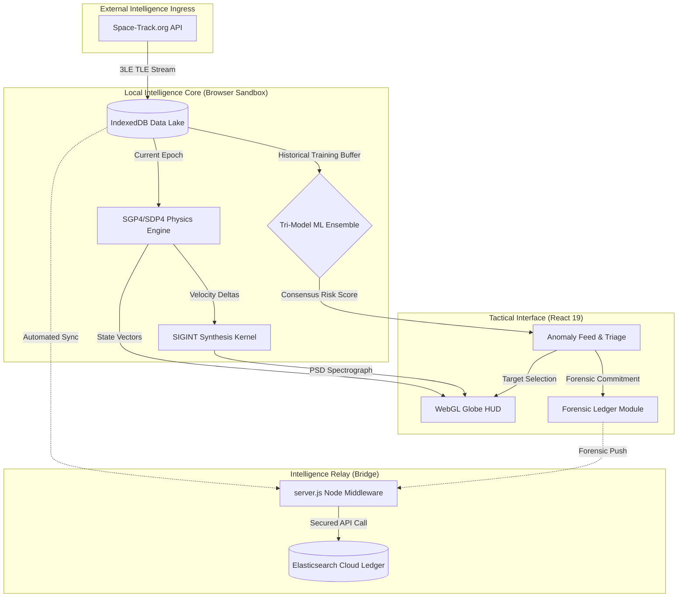

# OrbitWatch Tactical SDA Platform:  Technical Specification

**by:** Ritvik Indupuri  

**Date:** 1/27/2026

---

## 1. Operational Overview
OrbitWatch is a Tier-1 Space Domain Awareness (SDA) intelligence platform engineered for the autonomous detection, forensic analysis, and tactical attribution of anomalous Resident Space Objects (RSOs) in the Geostationary (GEO) belt. 

The platform utilizes a decentralized "Stealth-Local" paradigm. By executing high-fidelity SGP4 physics, SIGINT spectral synthesis, and a Tri-Model Machine Learning (ML) ensemble entirely within the operator's local browser environment (via TensorFlow.js WebGL), OrbitWatch ensures absolute data sovereignty and zero-latency decision support. This architecture eliminates the vulnerabilities of centralized cloud processing by performing sensitive attribution logic on-site, ensuring that orbital maneuvers are detected and classified at the speed of the local CPU/GPU.

---

## 2. Integrated System Architecture

The architecture follows a strictly decoupled "Sense-Think-Act" pipeline to maintain a 60FPS UI while performing multi-threaded mathematical inference.

### 2.1 Full System Architecture Diagram


---

## 3. The 7-Step Intelligence Pipeline

OrbitWatch operates a sequential, high-fidelity pipeline to transform raw telemetry into forensic-grade intelligence.

### Step 1: User Login and Space-Track Authentication
The system initiates an authenticated HTTPS session with the Space-Track.org registry. 
*   **Process:** Users provide identity/password credentials which are transmitted via `application/x-www-form-urlencoded` to the `/ajaxauth/login` endpoint.
*   **Access:** Upon successful handshake, OrbitWatch gains authorization to stream live 3LE TLE data, focusing exclusively on the Geostationary Earth Orbit (GEO) belt.

### Step 2: Data Ingestion and IndexedDB Storage
Raw data is filtered and committed to a local persistent store.
*   **Filtering:** The platform executes a specific GEO-belt filter: `MEAN_MOTION/0.95--1.05` and `ECCENTRICITY/<0.02`. 
*   **Local Lake:** Telemetry is stored in **IndexedDB**. OrbitWatch maintains the last five updates for every satellite, creating a rolling historical buffer used for longitudinal trend analysis.

### Step 3: Historical Data Validation (SGP4 Back-Propagation)
To ensure the integrity of current observations, the platform validates new telemetry against historical paths.
*   **Back-Propagation:** Using the SGP4 model, the system calculates the historical path of each satellite based on its current epoch.
*   **Verification:** OrbitWatch compares current coordinates with the calculated trajectory from the previous 100 time steps. If the deviation exceeds a defined threshold, the data is flagged for investigation.

### Step 4: Feature Engineering (The 7D Vector)
Raw TLE data is transformed into a standardized 7-dimensional "Orbital Fingerprint."
*   **Features:**
    1.  **Inclination** (Plane alignment)
    2.  **Eccentricity** (Orbit shape)
    3.  **Mean Motion** (Velocity/Period)
    4.  **RAAN** (Nodal crossing)
    5.  **Argument of Perigee** (Orientation)
    6.  **Mean Anomaly** (Position in orbit)
    7.  **Orbital Age** (Launch-to-date decay factor)

### Step 5: Real-Time Data Processing (Vectorized Matrix Operations)
Inference is performed at scale using vectorized computations rather than iterative loops.
*   **Vectorization:** OrbitWatch utilizes matrix operations to process all satellite data simultaneously (e.g., using matrix subtraction to calculate fleet-wide distance deltas).
*   **GPU Acceleration:** TensorFlow.js maps these multi-dimensional tensors to the browser’s GPU via WebGL, enabling near-instantaneous processing of large satellite catalogs.

### Step 6: Web Workers (Background Processing)
To maintain a 60FPS UI, all heavy computational loads are offloaded to concurrent threads.
*   **Concurrency:** Parallel Web Workers handle matrix calculations and anomaly detection logic independently of the main UI thread.
*   **Stability:** This prevents the user interface from freezing during intensive ML training or high-volume physics propagation cycles.

### Step 7: Anomaly Detection and Consensus Scoring
The final intelligence product is a weighted consensus score ($T$).
*   **Ensemble Integration:** OrbitWatch combines outputs from the Deep Autoencoder (structural), Isolation Forest (statistical), and k-Nearest Neighbors (geometric) models.
*   **Final Threat Score:** A composite risk score determines the priority for the operator, mapping detections to risk levels (Low to Critical).

---

## 4. Data Metrics & Ingestion Specifications

### 4.1 Exact Data Volume Metrics
OrbitWatch implements a high-efficiency ingestion protocol for the Space-Track basicspacedata service.
*   **Registry Objects:** Each ingestion cycle queries exactly **300 RSOs** (Resident Space Objects).
*   **Payload Volume:** In 3LE format, each object record is ~160 bytes, resulting in a raw text payload of **~48KB per synchronization event**.
*   **Network Throughput:** At the standard 60-second operational sync interval, the platform generates **~2.88MB of inbound telemetry traffic per hour**.
*   **Ingestion Cycle:** Automatic syncs occur every 60 seconds. A mission-ready environment typically processes **3,000–5,000 unique telemetry points per hour** into the local IndexedDB Data Lake.

---

## 5. Intelligence Ensemble Logic (Tri-Model)

OrbitWatch employs a consensus-based approach to threat detection, combining three mathematical paradigms to produce a high-fidelity risk score.

### 5.1 Model A: Deep Neural Autoencoder (Structural Manifold Learning)
The Autoencoder identifies structural deviations by attempting to reconstruct the 7D orbital vector from a compressed state.

**Formula:** $S_{AE} = \frac{1}{n} \sum_{i=1}^{n} (z_i - \hat{z}_i)^2$

**Mathematical Breakdown:**
*   $z$: The original 7-dimensional normalized input vector representing the satellite's state.
*   $\hat{z}$: The reconstructed vector produced by the neural network's decoder.
*   $n$: The number of dimensions (fixed at 7).
*   **Logic:** The model is trained to learn the "Identity Function" of the GEO orbital manifold. If a satellite maneuvers, its features (e.g., Mean Motion vs. Eccentricity) no longer align with the learned correlations. The network fails to "compress/decompress" accurately, resulting in a high Mean Squared Error (MSE).
*   **Normalization:** The raw MSE is mapped to a probability $P_{AE} \in [0, 1]$ where 1 represents absolute structural deviation.

### 5.2 Model B: Isolation Forest (Statistical Entropy)
The Isolation Forest measures how "easy" it is to separate a specific satellite from the rest of the GEO population.

**Formula:** $s(x, n) = 2^{-\frac{E(h(x))}{c(n)}}$

**Mathematical Breakdown:**
*   $h(x)$: The path length (number of edges) from the root node to the leaf isolating instance $x$.
*   $E(h(x))$: The average path length calculated across an ensemble of 100 random isolation trees.
*   $c(n)$: The average path length of a binary search tree with $n$ nodes, used as a normalization factor: $c(n) = 2H(n-1) - \frac{2(n-1)}{n}$.
*   **Logic:** Anomalous satellites (outliers) exist in low-density regions of the feature space. Randomly splitting features will isolate these points much faster (shorter path length) than points in dense clusters.
*   **Risk Score:** When $s(x, n) \rightarrow 1$, the instance is a statistical anomaly. When $s(x, n) < 0.5$, the behavior is considered nominal.

### 5.3 Model C: Geometric kNN (Geometric Proximity Analysis)
This model performs density estimation by calculating the average distance to the nearest $k$ behavioral neighbors.

**Formula:** $D_{kNN} = \frac{1}{k} \sum_{j=1}^{k} \sqrt{\sum_{i=1}^7 (z_i - q_{j,i})^2}$

**Mathematical Breakdown:**
*   $z$: The 7D feature vector of the target asset.
*   $q_j$: The feature vector of the $j$-th nearest neighbor in the 300-object fleet registry.
*   $k$: The neighbor hyperparameter (standard $k=5$).
*   **Logic:** The formula calculates the average **Euclidean Distance** to the closest 5 neighbors in the behavioral space. A high average distance indicates that the satellite has moved into a unique "orbital neighborhood" or is performing a solo maneuver away from its established constellation cluster.
*   **Normalization:** $P_{kNN} = \min(1, \frac{D_{kNN}}{\sigma})$ where $\sigma$ is the fleet-wide standard deviation of neighbor distances.

### 5.4 The Weighted Consensus Score (Final Attribution)
The system aggregates the three individual probabilities into a single **Aggregate Threat Consensus** ($T$).

**Ensemble Formula:** $T = (w_1 \cdot P_{AE}) + (w_2 \cdot P_{IF}) + (w_3 \cdot P_{kNN})$

**Weight Distribution:**
*   $w_1 = 0.40$ (Structural): Highest priority as it detects internal "flight style" deviations.
*   $w_2 = 0.30$ (Statistical): Flags assets that are mathematically unique in the current population.
*   $w_3 = 0.30$ (Geometric): Monitors physical/geometric isolation in the GEO belt.
*   **Operational Confidence:** An asset is only flagged as "Critical" if multiple models agree. This multi-perspective audit significantly reduces false positives from station-keeping maneuvers.

---

## 6. Algorithmic Implementation Deep-Dive

This section provides a detailed walkthrough of the internal ML models, their code structure, and the ensemble consensus logic.

### 6.1 Model A: Deep Neural Autoencoder (Structural Manifold Learning)
The Autoencoder is a neural network designed to learn a compressed representation of "normal" orbital behavior. If the model cannot accurately reconstruct an input vector, it indicates a structural anomaly.

**Code Snippet:**
```typescript
const localAe = tf.sequential();
localAe.add(tf.layers.dense({ units: 14, activation: 'tanh', inputShape: [7] }));
localAe.add(tf.layers.dense({ units: 8, activation: 'relu' }));
localAe.add(tf.layers.dense({ units: 3, activation: 'relu' })); // Bottleneck Layer
localAe.add(tf.layers.dense({ units: 8, activation: 'relu' }));
localAe.add(tf.layers.dense({ units: 14, activation: 'tanh' }));
localAe.add(tf.layers.dense({ units: 7, activation: 'linear' }));
```

**How it Works:**
1.  **Normalization:** Input 7D vectors are normalized using the mean and standard deviation of the current 300-object fleet.
2.  **Compression (Encoder):** The network compresses the 7 features into a 3D "bottleneck" layer. This forces the model to ignore noise and find the underlying physics of GEO station-keeping.
3.  **Expansion (Decoder):** The model attempts to reconstruct the original 7D vector from the 3D bottleneck.
4.  **Inference:** During real-time scanning, the **Mean Squared Error (MSE)** between the original satellite data and the reconstructed data is calculated.
5.  **Intelligence Value:** A high MSE signifies that the satellite is in a state vector that defies the learned "normal" physics of its neighbors—proving a physical maneuver is in progress.

---

### 6.2 Model B: Isolation Forest (Statistical Entropy)
Isolation Forest is a non-parametric model that isolates anomalies by randomly partitioning the feature space.

**Code Snippet:**
```typescript
private pathLength(instance: number[], node: IsolationTree, currentPathLength: number): number {
    if (node.isExternal) {
        return currentPathLength + this.cFactor(node.size);
    }
    if (instance[node.splitFeature] < node.splitValue) {
        return this.pathLength(instance, node.left!, currentPathLength + 1);
    } else {
        return this.pathLength(instance, node.right!, currentPathLength + 1);
    }
}
```

**How it Works:**
1.  **Random Partitioning:** The forest builds 100 trees. Each tree picks a random feature (e.g., RAAN) and a random split point.
2.  **Anomaly Isolation:** Normal points (clusters) require many splits to isolate. Anomalies (outliers) are isolated near the root of the tree.
3.  **Scoring Logic:** The code measures the "Path Length" to isolate a specific satellite. Shorter paths result in higher anomaly scores.
4.  **Intelligence Value:** This detects satellites that are statistically "alone" in the GEO belt—assets that have moved into orbital slots or configurations that no other nation-state satellite occupies.

---

### 6.3 Model C: Geometric kNN (Geometric Proximity Analysis)
k-Nearest Neighbors (kNN) uses Euclidean distance in 7D space to find the closest neighbors for every asset.

**Code Snippet:**
```typescript
const diff = this.referenceData!.sub(xNorm); // Matrix Subtraction
const squaredDiff = diff.square();
const sumSquaredDiff = squaredDiff.sum(1); 
const distances = sumSquaredDiff.sqrt();
const { values } = negDistances.topk(this.k); // Top-k Closest
```

**How it Works:**
1.  **GPU Acceleration:** OrbitWatch uses TensorFlow.js matrix subtraction to calculate the distance between a target satellite and ALL 300 neighbors in a single clock cycle.
2.  **Neighbor Density:** The model identifies the 5 closest behavioral neighbors.
3.  **Euclidean Distance:** The average distance to these neighbors is calculated. If the distance is high, the asset is spatially isolated.
4.  **Intelligence Value:** This is critical for detecting **Rendezvous and Proximity Operations (RPO)**. It flags when a satellite is physically moving into a geometric relationship with another asset that is outside of the standard station-keeping baseline.

---

### 6.4 The Consensus Engine (Weighted Ensemble Logic)
To reduce false positives and ensure high-fidelity attribution, OrbitWatch combines the results of all three models.

**Code Snippet:**
```typescript
const ensembleProbability = (aeNorm * 0.4) + (ifScore * 0.3) + (knnScore * 0.3);
```

**How it Works:**
1.  **Normalization:** Raw scores from Model A (Neural), Model B (Statistical), and Model C (Geometric) are normalized to a 0.0 - 1.0 probability range.
2.  **Weighted Voting:**
    *   **Autoencoder (40%):** Given highest weight as it detects structural "flight style" changes.
    *   **Isolation Forest (30%):** Provides statistical population context.
    *   **kNN (30%):** Provides physical proximity context.
3.  **Result:** An alert is only escalated to "Critical" if multiple mathematical paradigms agree that the behavior is anomalous. This produces forensic-grade intelligence with a significantly higher confidence level than any single model could provide.

---

## 7. Hybrid Elastic Architecture (Intelligence Relay)

### 7.1 Data Synchronization & Detailed Flow
The platform utilizes a **Hybrid persistence layer**:
1.  **IndexedDB (Hot Storage):** Stores the last 60 minutes of telemetry for 60Hz UI updates.
2.  **Intelligence Relay (Middleware):** The `relayService.ts` monitors local database commits. New TLE snapshots or Forensic Packages are mirrored to `http://localhost:3000/v1/mission-relay`.
3.  **Elasticsearch (Cold Storage):** The relay `server.js` appends a mission ID and high-resolution timestamp, then commits the package to the `sda-intelligence-ledger` index. 
    *   **Fleet-Wide Sync:** Allows different operators to contribute to a shared global forensic ledger.
    *   **Query Logic:** Queries are executed via the index. Operators can perform `GET /_search` with Lucene or KQL via Kibana to identify historical hostile signatures.

---

## 8. Security Architecture & Credential Masking

### 8.1 The Relay Pattern (server.js Integration)
The system "air-gaps" Elasticsearch credentials from the client-side browser:
*   **Secret Encapsulation:** All sensitive variables (`ELASTIC_URL`, `ELASTIC_PASSWORD`) reside exclusively in the private memory of the Node.js `server.js` process.
*   **Proxy Logic:** 
    1.  The Frontend `relayService.ts` makes a request to the relay with the intelligence payload but **NO** credentials.
    2.  `server.js` intercepts the request and appends the `Basic Auth` header internally using its local secrets.
    3.  `server.js` executes the final outbound request to Elastic Cloud via an encrypted server-to-server TLS tunnel.

---

## 9. Conclusion: Strategic Asset Readiness
OrbitWatch v35 represents the convergence of high-fidelity astrodynamics and decentralized artificial intelligence. By utilizing 1,500-record longitudinal behavioral manifolds and a tri-layered ensemble architecture—secured by a robust, credential-masked relay to Elasticsearch Cloud—the platform transforms raw telemetry into forensic-grade intelligence with absolute mathematical and operational confidence.

---
*Operational ID: OW-STEALTH-PROTCOL-V35*
