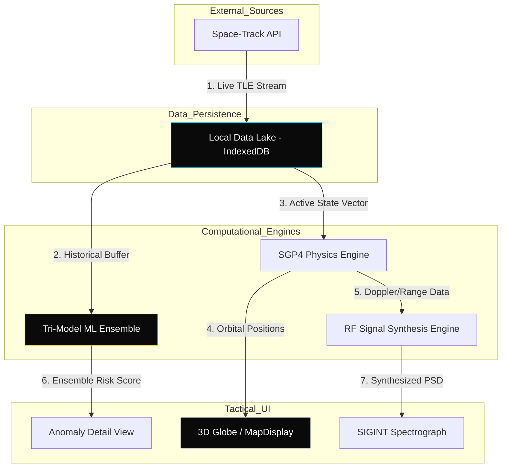
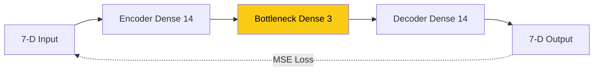
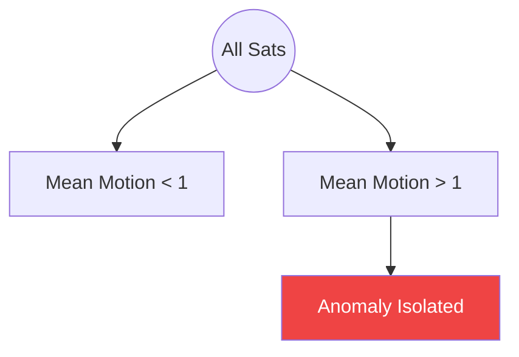
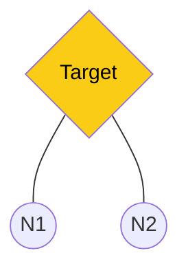

# OrbitWatch Tactical SDA Platform: Technical Specification
**By: Ritvik Indupuri**  
**Date: 12/24/2025**

## Table of Contents
1.  [Executive Summary](#executive-summary)
2.  [System Architecture & Operational Flow](#2-system-architecture--operational-flow)
3.  [Data Lake Architecture & Ingestion](#3-data-lake-architecture--ingestion)
4.  [RF Signal Analysis & SIGINT Synthesis](#4-rf-signal-analysis--sigint-synthesis)
5.  [SGP4/SDP4 Orbital Propagation Engine](#5-sgp4sdp4-orbital-propagation-engine)
6.  [Machine Learning Ensemble Training](#6-machine-learning-ensemble-training)
7.  [Conclusion](#conclusion)

---

## Executive Summary
OrbitWatch is an advanced Space Domain Awareness (SDA) platform designed to identify and attribute anomalous behavior in the Geostationary (GEO) belt. The platform leverages a decentralized architecture, moving heavy computation to the tactical edge. By integrating high-fidelity physics with a tri-model ML ensemble, OrbitWatch provides a 1:1 digital twin of the orbital environment capable of detecting cyber-kinetic threats in real-time.

---

## 2. System Architecture & Operational Flow

The OrbitWatch architecture is designed to minimize latency by localizing the "Intelligence Core." All processing—from physics propagation to neural network inference—happens within the operator's browser session.

  <b>FIGURE 1: SYSTEM ARCHITECTURE & DATA SYNERGY</b> 

### 2.1 Operational Flow Breakdown
1.  **Ingestion Flow**: TLE data is ingested via HTTPS and persisted into the **Local Data Lake**.
2.  **Physics Flow**: The **SGP4 Engine** queries the Data Lake for the latest TLE epoch and propagates Cartesian state vectors ($r, v$) for the UI.
3.  **Intelligence Flow**: The **ML Ensemble** scans historical snapshots in the Data Lake to establish a "Physics Manifold," identifying assets that deviate from expected patterns.
4.  **Spectral Flow**: The **RF Engine** utilizes the instantaneous range and velocity from the Physics Flow to synthesize a real-time Power Spectral Density (PSD) plot.

**Transition**: *With the high-level architecture defined, we move to the foundational layer that powers these flows: the Local Data Lake.*

---

## 3. Data Lake Architecture & Ingestion

The Local Data Lake acts as the platform's "Single Source of Truth," replacing cloud-based databases with a localized **IndexedDB** instance.

### 3.1 Ingestion & Longitudinal Snapshots
The system performs automated background synchronization every **60 seconds**. Each "snapshot" captures the state of ~300 GEO assets. 
*   **Persistent Indexing**: Every ingested TLE is indexed by `NORAD_CAT_ID` and `TIMESTAMP`.
*   **Buffer Management**: The system maintains the last **5 historical snapshots** (approx. 3,000 records) to provide a longitudinal training set for the ML models, ensuring they account for natural gravitational perturbations.

**Transition**: *Once the data is securely localized, the platform begins simulating the electromagnetic environment of these assets through SIGINT synthesis.*

---

## 4. RF Signal Analysis & SIGINT Synthesis

The RF engine models how a satellite's physical motion manifests as an electromagnetic signature.

### 4.1 Sourcing Calculation Inputs
To maintain physical fidelity, the following formulas derive their variables directly from the SGP4 Physics Engine:

| Variable | Definition | Source of Truth |
| :--- | :--- | :--- |
| **$f_c$** | Center Frequency | Mission Metadata (e.g., Ku-Band = 12GHz) |
| **$v_{radial}$** | Radial Velocity | Magnitude of velocity vector ($\vec{v}$) from SGP4 engine |
| **$d$** | Slant Range | Scalar distance from Observer to SGP4 position ($\vec{r}$) |

### 4.2 Core Formulas
1.  **Doppler Shift**: $f_{obs} = f_c \left(1 + \frac{v_{radial}}{c}\right)$
2.  **Path Loss**: $FSPL (dB) = 20 \log_{10}(d) + 20 \log_{10}(f) + 92.45$

**Transition**: *The accuracy of these spectral signatures depends entirely on the precision of the underlying orbital propagator.*

---

## 5. SGP4/SDP4 Orbital Propagation Engine

The SGP4 engine is the "Physics Core" of OrbitWatch, responsible for translating TLE mean elements into 3D Cartesian space.

### 5.1 Historical Back-Propagation ($t < 0$)
To detect past maneuvers, the engine runs in a "Negative Temporal Mode."
*   **Logic**: The system calculates the state vector for $T-24H$. If the resulting ballistic position deviates significantly from the *actual* historical record in the Data Lake, a maneuver is flagged.
*   **Purpose**: This establishes the "Ballistic Baseline"—what the satellite *should* have done without active propulsion.

### 5.2 Forecasting & RPO Prediction ($t > 0$)
The engine also projects forward to identify future threats.
*   **Logic**: Propagating to $T+1H$ allows the system to calculate the "Relative Distance" between two converging assets.
*   **Purpose**: Early warning for Rendezvous and Proximity Operations (RPO).

**Transition**: *While the Physics Engine defines ballistic norms, identifying deliberate hostile behavior requires the nuanced pattern recognition of the ML Ensemble.*

---

## 6. Machine Learning Ensemble Training

OrbitWatch utilizes a Tri-Model approach to ensure robust detection. All models are trained using **TensorFlow.js** on the localized training set retrieved from the Data Lake.

### 6.1 Model A: Deep Autoencoder (Neural Reconstruction)
*   **How it Works**: A Sequential neural network that learns to compress and reconstruct 7-D state vectors.
*   **Training**: Trained for 30 epochs on ~3,000 records. Anomalies are defined by high **Reconstruction Error (MSE)**.

  <b>FIGURE 2: AUTOENCODER NEURAL ARCHITECTURE</b> 

### 6.2 Model B: Isolation Forest (Statistical Density)
*   **How it Works**: A tree-based ensemble that partitions the parameter space.
*   **Training**: Constructs **100 trees**. Anomalies are assets that "isolate" at shallow depths in the trees.

  <b>FIGURE 3: ISOLATION FOREST PARTITIONING</b> 

### 6.3 Model C: k-Nearest Neighbors (Geometric Proximity)
*   **How it Works**: Calculates Euclidean distance to the 5 nearest neighbors in the feature space.
*   **Training**: Indexes 500 reference assets. High mean distance signifies an asset migrating from its assigned slot.

  <b>FIGURE 4: kNN GEOMETRIC PROXIMITY</b> 

---

## Conclusion
The logical integration of localized data, high-fidelity physics, and a tri-model ensemble allows OrbitWatch to attribute space threats with unprecedented speed. By following this technical pipeline—from ingestion to spectral analysis and finally into the "Intelligence Core"—the platform ensures the operator is always ahead of the threat cycle.