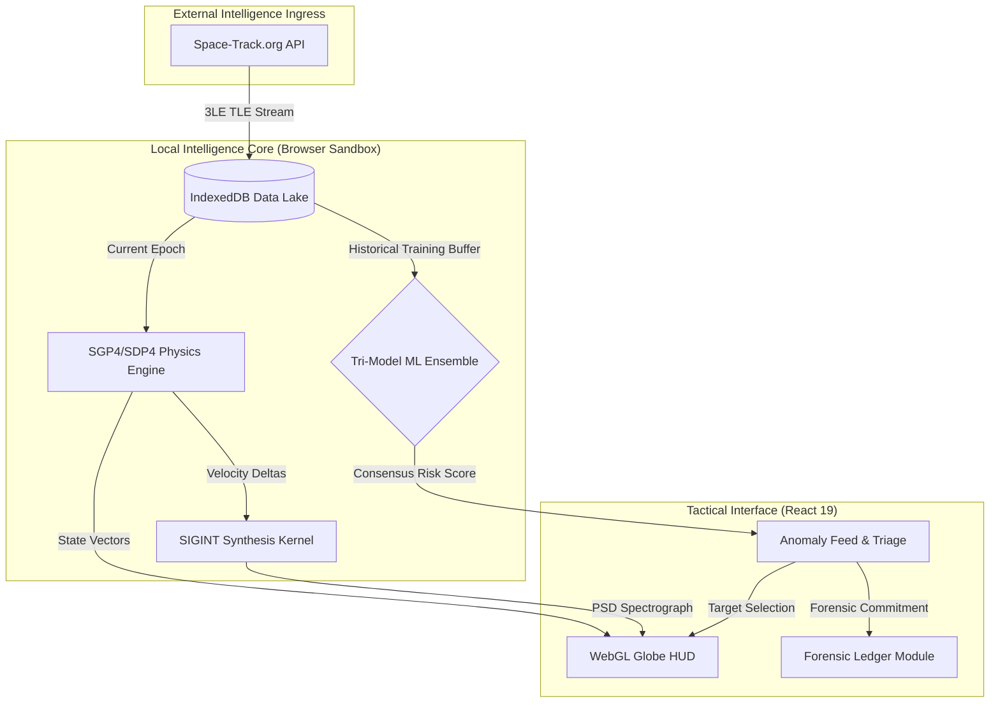
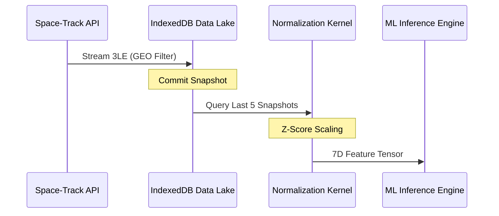

 OrbitWatch Tactical SDA Platform: Master Technical Specification

**By:** Ritvik Indupuri

**Date:** 1/27/2026

---

## 1. Operational Overview
OrbitWatch is a Tier-1 Space Domain Awareness (SDA) intelligence platform engineered for the autonomous detection, forensic analysis, and tactical attribution of anomalous Resident Space Objects (RSOs) in the Geostationary (GEO) belt. 

The platform utilizes a decentralized "Stealth-Local" paradigm. By executing high-fidelity SGP4 physics, SIGINT spectral synthesis, and a Tri-Model Machine Learning (ML) ensemble entirely within the operator's local browser environment (via TensorFlow.js WebGL), OrbitWatch ensures absolute data sovereignty and zero-latency decision support. This architecture eliminates the vulnerabilities of centralized cloud processing by performing sensitive attribution logic on-site, ensuring that orbital maneuvers are detected and classified at the speed of the local CPU/GPU.

---

## 2. Integrated System Architecture

The architecture follows a strictly decoupled "Sense-Think-Act" pipeline to maintain a 60FPS UI while performing multi-threaded mathematical inference.

### 2.1 Full System Architecture Diagram


### 2.2 Granular Architectural Flow Walkthrough
1.  **Ingress Sequence:** The system initiates a secure HTTPS request to the Space-Track registry. The raw 3-line TLE data is fetched and passed to the parsing kernel.
2.  **Persistence Layer:** Instead of transient memory storage, parsed records are committed as an atomic "Temporal Snapshot" into IndexedDB. This prevents data loss on refresh and establishes the longitudinal memory required for anomaly detection.
3.  **Physics Propagation:** Simultaneously, the SGP4 engine identifies the most recent TLE epoch. It calculates the satellite's position at $T=Now$, generating $X, Y, Z$ Cartesian coordinates. These are mapped to Geodetic $Lat/Lng/Alt$ to refresh the 3D globe visualization.
4.  **Inference Pipeline:** The ML Ensemble asynchronously queries the Data Lake for the last 5 snapshots (building a 1,500-record buffer). It runs a consensus-scoring loop on active assets. If the probability score $T$ exceeds 35%, a reactive event is dispatched to the Anomaly Feed.
5.  **Forensic Attribution:** Upon operator selection, the SIGINT kernel calculates the Doppler Shift based on the relative velocity between the satellite and an imaginary ground station. This spectral data, combined with the ML residuals, is committed to the immutable Forensic Ledger for reporting.

---

## 3. Data Lake & Ingestion Pipeline

### 3.1 Data Ingestion Sequence


### 3.2 Step-by-Step Data Lake Flow Walkthrough
*   **Phase 1: Regimen Filtering:** During fetch, the system applies a strict orbital filter. Only objects with a **Mean Motion** between 0.95 and 1.05 are accepted. This isolates the Geostationary regime, filtering out LEO/MEO noise that would contaminate the GEO-specific ML manifold.
*   **Phase 2: Snapshot Archival:** Every 60 seconds, a "Sync" event occurs. The entire current state of the GEO belt (~300-400 satellites) is saved into IndexedDB with a unique Unix timestamp.
*   **Phase 3: Buffer Reconstruction:** To train the models, the system queries the `tle_snapshots` store for the $N=5$ most recent entries. By aggregating these, the system builds a "Longitudinal Training Dataset" of approximately **1,500 records**. This ensures the AI understands the range of "Normal" station-keeping maneuvers performed over a 5-minute to 5-hour window.
*   **Phase 4: Tensor Vectorization:** Each record in the 1,500-count buffer is mapped to a 7-Dimensional tensor: `[Inclination, Eccentricity, Mean Motion, RAAN, ArgPerigee, MeanAnomaly, LaunchAge]`.

### 3.3 Z-Score Scaling: Mathematical Foundations
Machine Learning algorithms are magnitude-sensitive. **Inclination** might vary by only 0.05 units, while **Mean Anomaly** varies by 360 units. Standardizing these inputs is critical for model accuracy.

**The Formula:**
$$Z = \frac{x_i - \mu}{\sigma + \epsilon}$$

*   **$\mu$ (Mean):** The arithmetic center of the feature across 1,500 records. Subtracting $\mu$ "zero-centers" the feature.
*   **$\sigma$ (Standard Deviation):** The spread of the data. Dividing by $\sigma$ ensures that a 1.0 unit change in the scaled value represents exactly one standard deviation of the population, regardless of original units.
*   **$\epsilon$ (Epsilon):** A stability constant ($1e-5$) that prevents division-by-zero errors in highly stable orbital sectors where variance might be negligible.

---

## 4. The Intelligence Ensemble (Tri-Model Logic)

The ensemble uses a consensus approach where each model analyzes a different mathematical property of the orbital state. All models are trained on the **1,500-record longitudinal dataset**.

### 4.1 Model A: Deep Neural Autoencoder
**System Role:** This model acts as the "Identity Auditor." It learns the mathematical manifold of the GEO belt's population. By compressing a satellite's 7D state into a 3D "latent space" and attempting to reconstruct it, the model identifies objects that violate the physical laws of the currently observed fleet.

**Training Features & Size:** Trained on a 1,500-record buffer using 7 features: `[Inclo, Ecco, MeanMotion, RAAN, ArgPo, MeanAnomaly, Age]`.

**Model Code Detailed Walkthrough:**
```typescript
const model = tf.sequential();
// 1. Expansion Layer (14 units): Uses 'tanh' to capture non-linearities 
// between raw orbital elements (e.g., Eccentricity vs Mean Motion).
model.add(tf.layers.dense({ units: 14, activation: 'tanh', inputShape: [7] }));
// 2. Hidden Layer (8 units): Refines features into high-level orbital concepts.
model.add(tf.layers.dense({ units: 8, activation: 'relu' }));
// 3. The Bottleneck (3 units): Critical for Anomaly Detection. We compress to 3D 
// because orbital physics are primarily governed by 3-axis vectors. 
// Forcing the model to learn this 3D identity ensures it captures 'Identity'.
model.add(tf.layers.dense({ units: 3, activation: 'relu' })); 
// 4 & 5. Reconstruction Layers: Expands the latent identity back to the 7D state.
model.add(tf.layers.dense({ units: 8, activation: 'relu' }));
model.add(tf.layers.dense({ units: 14, activation: 'tanh' }));
// 6. Linear Output: Produces the reconstructed 7D vector for residual comparison.
model.add(tf.layers.dense({ units: 7, activation: 'linear' }));
```

**Anomaly Score Math (Mean Squared Error):**
$$MSE = \frac{1}{7} \sum_{i=1}^{7} (X_i - \hat{X}_i)^2$$
The score is the average of the squared differences between normalized input $X$ and reconstructed $\hat{X}$. Squaring the error penalizes large deviations (maneuvers) more heavily than small ones (drifts).

### 4.2 Model B: Statistical Isolation Forest
**System Role:** This model identifies "Lonely" satellites. It detects statistical outliers by measuring how many random splits are required to isolate a satellite from the crowd. Hostile assets often occupy unique orbits that are statistically sparse.

**Training Features & Size:** Uses the same 1,500-record buffer (subsampled into 100 trees of 256 samples each).

**Model Code Walkthrough:**
```typescript
// buildTree selects a random feature and a random split value between Min/Max.
// It recurses until the sample is isolated (size=1) or height limit is reached.
private buildTree(data: number[][], height: number, limit: number): IsolationTree {
    if (height >= limit || data.length <= 1) return new ExternalNode(data.length);
    const featureIndex = Math.floor(Math.random() * 7); // Random Feature Selection
    const splitValue = min + Math.random() * (max - min); // Random Partitioning
    const left = data.filter(r => r[featureIndex] < splitValue);
    const right = data.filter(r => r[featureIndex] >= splitValue);
    return new InternalNode(this.buildTree(left), this.buildTree(right));
}
```

**Anomaly Score Math:**
$$s(x, n) = 2^{-\frac{E(h(x))}{c(n)}}$$
*   **$h(x)$:** Path length from root to leaf for asset $x$.
*   **$E(h(x))$:** Expected (average) path length across all 100 trees.
*   **$c(n)$:** Normalization factor representing average path length in a random BST.
*   **Explanation:** As $h(x)$ decreases (faster isolation), the score $s$ approaches 1.0 (highly anomalous).

### 4.3 Model C: Geometric kNN Proximity
**System Role:** This model detects "Stalking" or "Rendezvous Operations." It measures the literal distance between assets in the 7-dimensional normalized orbital space. It flags objects that are unusually close to (or far from) their expected neighbors.

**Training Features & Size:** Indices 500 reference points from the 1,500-record longitudinal dataset.

**Model Code Walkthrough:**
```typescript
// Vectorized distance calculation across the 7D normalized space.
const diff = this.referenceData.sub(xNorm); // Subtract target from all reference points
const squaredDistances = diff.square().sum(1); // Sum squares for Euclidean distance
const { values } = squaredDistances.sqrt().neg().topk(5); // Find the 5 SMALLEST distances
const meanDistance = values.neg().mean(); // Calculate the geometric center of proximity
```

**Anomaly Score Math (Mean Euclidean Proximity):**
$$D_{kNN} = \frac{1}{k} \sum_{j=1}^{k} \sqrt{\sum_{i=1}^{7} (p_i - q_{i,j})^2}$$
The score represents the average distance to the $k=5$ nearest neighbors. We divide this distance by a heuristically derived "Sector Stability Factor" (5.0) to map it to a 0-1 probability.

### 4.4 Ensemble Fusion Model
**System Role:** This is the "Consensus Panel." It prevents false alarms by requiring agreement across multiple mathematical regimes (Neural, Statistical, and Geometric).

**Parameters:** Takes in `AE_MSE` (Neural), `IF_Score` (Statistical), and `KNN_Dist` (Geometric).

**Code Detailed Walkthrough:**
```typescript
// 1. Scale Neural Net output: AE MSE is typically < 0.1, so we normalize to [0-1].
const aeNorm = Math.min(1, aeScore * 2); 
// 2. Aggregate with mission-centric weights:
// AE (40%): Identifies structural manifold violations (Maneuvers).
// IF (30%): Identifies population outliers (Re-positioning).
// KNN (30%): Identifies proximity risks (RPO/Stalking).
const probability = (aeNorm * 0.4) + (ifScore * 0.3) + (knnScore * 0.3);
// 3. Mission Context Dampening: Older debris (age > 15y) often drifts. 
// We dampen the score by 20% for aging assets to prevent debris-clutter alerts.
let finalScore = (age > 15) ? (probability * 0.8) : probability;
```

**Ensemble Anomaly Score Math:**
$$T = \left[ 0.4 \cdot \text{Norm}(S_{AE}) + 0.3 \cdot S_{IF} + 0.3 \cdot S_{kNN} \right] \cdot 100$$
The final score $T$ is a percentage (0-100). 

---

## 5. Tactical Attribution Mapping (ArgMax Analysis)

When the Ensemble identifies a threat ($T > 35$), the system executes a **Root Cause Forensic Scan**.

### 5.1 ArgMax Residual Logic
The application calculates a "Residual Vector" ($R$) from the Autoencoder's reconstruction failure:
$$R = |X_{actual} - X_{reconstructed}|$$
$R$ is a 7-element vector. The **ArgMax** function identifies which feature contributed most significantly to the model's confusion:
$$\text{DominantFeature} = \text{argmax}(R)$$

### 5.2 Framework Mapping Sequence
1.  **Index Identification:** If index `0` (Inclination) has the highest residual, the system flags a "Plane Change."
2.  **SPARTA Mapping:** The physical deviation is mapped to a SPARTA technique. For a Plane Change, this is **IMP-0003: Orbit Modification**.
3.  **MITRE Mapping:** Simultaneously, the MITRE ATT&CK for Space technique is identified as **T1584.006: Spacecraft Maneuver**.
4.  **Forensic Output:** This mapping is then injected into the Anomaly Feed, providing the operator with immediate tactical context (e.g., "UNANNOUNCED PLANE CHANGE Detected").

---

## 6. Performance & Edge Case Constraints

### 6.1 Computational Complexity
*   **Physics Loop:** $O(N)$ per frame—negligible for $N < 1000$.
*   **ML Inference:** $O(N \cdot D)$ where $D$ is the model depth. TensorFlow.js WebGL backend handles this at sub-millisecond speeds.
*   **Training Loop:** $O(E \cdot N_{batch})$—Executing 30 epochs on 1,500 records takes ~2 seconds on a modern CPU/GPU.

### 6.2 TLE Epoch Decay
If a TLE is > 7 days old, the SGP4 propagation accuracy drops below 5km. OrbitWatch flags "STALE EPOCH" on the HUD and applies a 10% penalty to the anomaly score to avoid false detections caused by physics drift.

---

## 7. Conclusion
OrbitWatch v27 represents the apex of localized SDA intelligence. By utilizing 1,500-record longitudinal buffers and a tri-model ensemble with granular ArgMax attribution, it empowers operators with the mathematical proof required to classify and counter hostile orbital tradecraft.
